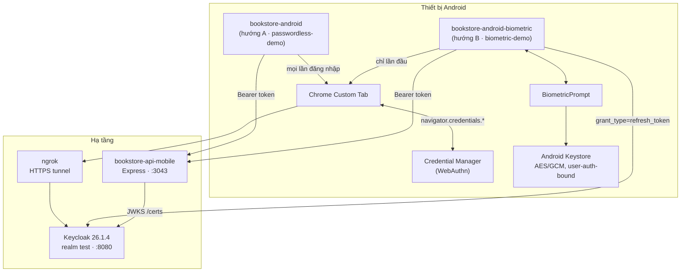
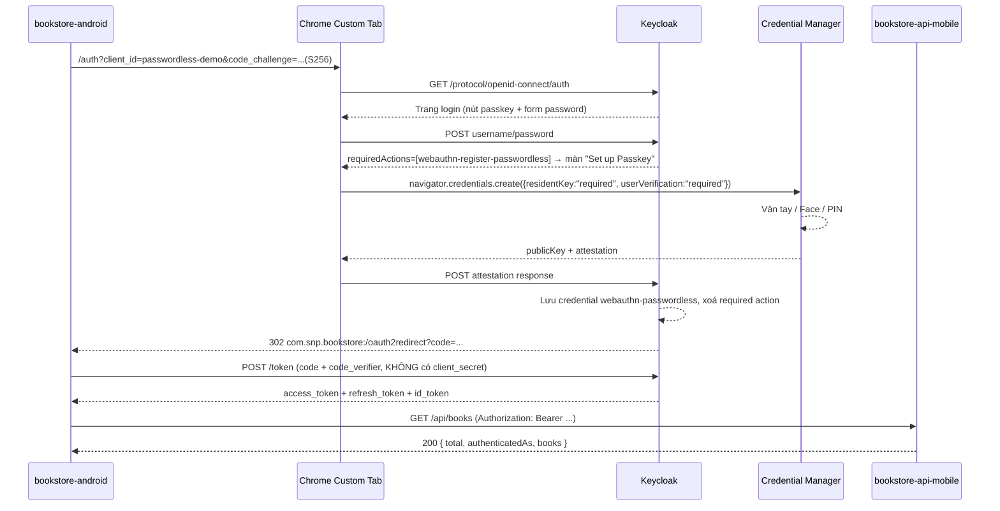
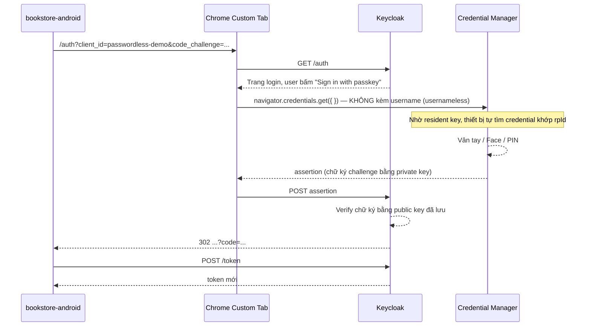
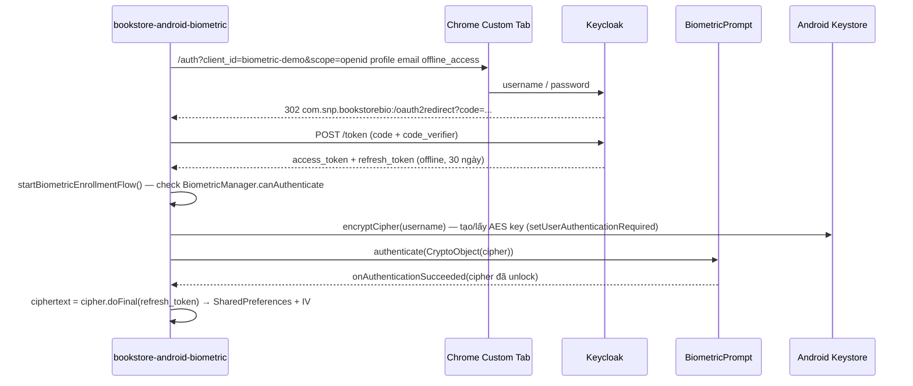
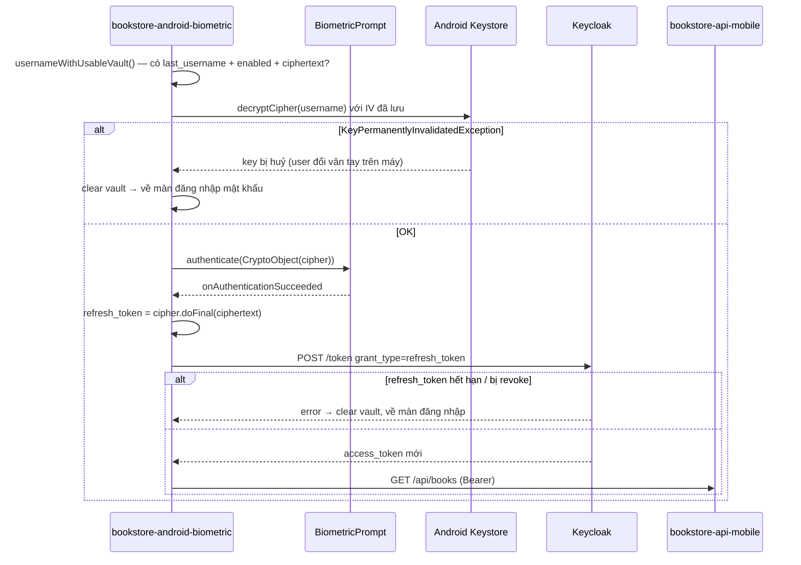

# PoC — Đăng nhập Passwordless cho ứng dụng Android với Keycloak

**Tài liệu Proof of Concept** · Kiểm chứng hai hướng tiếp cận loại bỏ mật khẩu cho app
mobile, hiện thực trên nền Keycloak sẵn có.

| | |
|---|---|
| **Loại tài liệu** | Proof of Concept (PoC) — kiểm chứng khả thi kỹ thuật, chưa phải thiết kế production |
| **Phiên bản** | 1.0 |
| **Ngày** | 05/08/2026 |
| **Trạng thái** | Đã hiện thực và chạy được cả hai hướng |
| **Hệ thống nền** | Keycloak 26.1.4, realm `test` |
| **Phạm vi mã nguồn** | `bookstore-android/`, `bookstore-android-biometric/`, `bookstore-api-mobile/` |

---

## Mục lục

**Phần I — Đề bài**

1. [Bối cảnh và vấn đề](#1-bối-cảnh-và-vấn-đề)
2. [Mục tiêu PoC và tiêu chí đánh giá](#2-mục-tiêu-poc-và-tiêu-chí-đánh-giá)
3. [Không gian giải pháp và lý do lựa chọn](#3-không-gian-giải-pháp-và-lý-do-lựa-chọn)
4. [Phạm vi và giả định](#4-phạm-vi-và-giả-định)

**Phần II — Hiện thực**

5. [Kiến trúc hệ thống](#5-kiến-trúc-hệ-thống)
6. [Hướng A — WebAuthn Passwordless](#6-hướng-a--webauthn-passwordless-bookstore-android)
7. [Hướng B — Local Biometric App-Lock](#7-hướng-b--local-biometric-app-lock-bookstore-android-biometric)
8. [Backend dùng chung — `bookstore-api-mobile`](#8-backend-dùng-chung--bookstore-api-mobile)

**Phần III — Kết quả**

9. [Kết quả kiểm chứng giả thuyết](#9-kết-quả-kiểm-chứng-giả-thuyết)
10. [So sánh hai hướng](#10-so-sánh-hai-hướng)
11. [Rào cản kỹ thuật đã gặp](#11-rào-cản-kỹ-thuật-đã-gặp)
12. [Đánh giá bảo mật](#12-đánh-giá-bảo-mật)
13. [Kết luận và khuyến nghị lộ trình](#13-kết-luận-và-khuyến-nghị-lộ-trình)
14. [Phụ lục — Hướng dẫn tái lập](#14-phụ-lục--hướng-dẫn-tái-lập)

---

# Phần I — Đề bài

## 1. Bối cảnh và vấn đề

### 1.1 Hiện trạng

Hệ thống hiện tại dùng Keycloak làm Identity Provider trung tâm cho nhiều ứng dụng
(web SPA, Razor, SAML SP, REST API). Toàn bộ đều xác thực bằng **username + password**
qua form login của Keycloak. Khi mở rộng sang ứng dụng Android native, mô hình này bộc lộ
đồng thời hai nhóm vấn đề.

### 1.2 Vấn đề bảo mật của mật khẩu

| Vấn đề | Mô tả |
|---|---|
| **Phishing** | Mật khẩu là bí mật *dùng lại được* — người dùng gõ nó vào đâu cũng được. Một trang giả mạo giao diện Keycloak là đủ để chiếm tài khoản. Đây là véc-tơ tấn công phổ biến nhất và MFA qua OTP cũng không chặn được hoàn toàn (real-time phishing proxy). |
| **Credential stuffing** | Người dùng dùng lại mật khẩu giữa các dịch vụ. Một vụ lộ dữ liệu ở nơi khác trở thành rủi ro cho hệ thống của mình. |
| **Rủi ro lưu trữ phía server** | Dù đã hash, DB mật khẩu vẫn là mục tiêu giá trị cao. Không có mật khẩu thì không có gì để lộ. |
| **Chi phí vận hành** | Reset mật khẩu là loại ticket support phổ biến nhất ở hầu hết tổ chức. |
| **Nhập liệu trên mobile** | Mật khẩu mạnh rất khó gõ trên bàn phím ảo → người dùng chọn mật khẩu yếu, hoặc lưu ở nơi không an toàn. |

### 1.3 Vấn đề trải nghiệm trên mobile

Đặc thù app mobile khác hẳn web: người dùng mở app **nhiều lần mỗi ngày**, mỗi phiên rất
ngắn. Với cấu hình realm hiện tại (`ssoSessionIdleTimeout` = 1800 giây = 30 phút), người
dùng phải đăng nhập lại sau mỗi 30 phút không hoạt động — điều này chấp nhận được trên
web nhưng là ma sát nghiêm trọng trên mobile.

Ngoài ra, luồng OAuth trên mobile có ràng buộc riêng:

- Không được dùng WebView (Google cấm từ 2016, và app host có thể đọc trộm form đăng nhập).
- App mobile là **public client** — không thể giữ `client_secret` an toàn trong APK.
- Mỗi lần đăng nhập phải nhảy sang trình duyệt rồi quay lại app qua deep link.

### 1.4 Câu hỏi đặt ra

> **Có thể loại bỏ việc người dùng nhập mật khẩu trên app Android, mà vẫn giữ Keycloak
> làm IdP trung tâm — không thay thế hạ tầng, không viết lại luồng xác thực của các app
> hiện có?**

PoC này được thực hiện để trả lời câu hỏi đó.

---

## 2. Mục tiêu PoC và tiêu chí đánh giá

### 2.1 Mục tiêu

1. **Kiểm chứng khả thi kỹ thuật**: Keycloak 26.x có thực sự hỗ trợ passwordless cho
   Android native đến mức dùng được, hay chỉ hỗ trợ trên giấy tờ?
2. **Đo độ phức tạp triển khai**: cần bao nhiêu thay đổi cấu hình, bao nhiêu code, và
   những ràng buộc hạ tầng nào (HTTPS, domain, phiên bản OS) là bắt buộc?
3. **Xác định giới hạn**: cái gì *không* làm được, và cái giá phải trả cho mỗi hướng.
4. **Đưa ra khuyến nghị** có căn cứ cho quyết định triển khai thật.

### 2.2 Giả thuyết cần kiểm chứng

| # | Giả thuyết | Trạng thái |
|---|---|---|
| H1 | Keycloak hỗ trợ WebAuthn passwordless đủ hoàn chỉnh để đăng nhập **không cần nhập username** trên Android | ✅ Đúng, có điều kiện — xem §9.1 |
| H2 | Có thể tích hợp mà không cần WebView, dùng Chrome Custom Tabs + AppAuth | ✅ Đúng |
| H3 | Có thể triển khai passwordless mà **không cần đổi hạ tầng sang HTTPS** | ❌ Sai với hướng A, ✅ đúng với hướng B |
| H4 | Có phương án giảm ma sát đăng nhập **không đụng tới cấu hình IdP** | ✅ Đúng — hướng B |
| H5 | Backend resource server có thể xác thực token mà không cần `client_secret` | ✅ Đúng — verify JWT qua JWKS |
| H6 | Một backend duy nhất phục vụ được cả hai hướng | ✅ Đúng — nhưng lộ ra vấn đề phân quyền, xem §12.2 |

### 2.3 Tiêu chí đánh giá

| Tiêu chí | Cách đo |
|---|---|
| **Chống phishing** | Yếu tố xác thực có bị dùng lại ở site giả mạo được không? |
| **Số thao tác đăng nhập lại** | Số chạm từ lúc mở app tới lúc thấy dữ liệu |
| **Ràng buộc hạ tầng** | Có bắt buộc HTTPS/domain cố định không? |
| **Khả năng thu hồi tập trung** | Admin có revoke được truy cập ngay khi mất thiết bị không? |
| **Độ phức tạp** | Số hạng mục cấu hình IdP + số dòng code phía client |
| **Khả năng áp dụng lại** | Có dùng lại được cho iOS/web không? |

---

## 3. Không gian giải pháp và lý do lựa chọn

Trước khi hiện thực, các phương án passwordless khả dụng trên nền Keycloak được đối chiếu
với đề bài ở §1.

### 3.1 Các phương án đã cân nhắc

| Phương án | Cơ chế | Kết luận |
|---|---|---|
| **OTP qua SMS / Email** | Gửi mã một lần tới kênh phụ | ❌ **Loại**. Không giải quyết phishing (mã vẫn gõ được vào site giả). Phụ thuộc nhà mạng, có chi phí, rủi ro SIM-swap. NIST SP 800-63B đã khuyến cáo hạn chế SMS từ 2016. |
| **Magic link qua email** | Link đăng nhập gửi vào hộp thư | ❌ **Loại**. Trải nghiệm mobile tệ (phải rời app sang mail rồi quay lại). Bảo mật quy về bảo mật hộp thư. Không giảm được ma sát hằng ngày. |
| **TOTP (Google Authenticator)** | Mã 6 số theo thời gian | ❌ **Loại** cho vai trò *thay thế* mật khẩu. TOTP trong Keycloak là **yếu tố thứ hai**, không thay được yếu tố thứ nhất. Vẫn phishable. |
| **Social login / Identity brokering** | Ủy quyền cho Google, Facebook… | ❌ **Loại**. Chỉ dời vấn đề sang IdP khác, phụ thuộc bên thứ ba, không phù hợp hệ thống nội bộ. |
| **mTLS / Certificate-based** | Chứng chỉ client X.509 | ❌ **Loại**. Keycloak có hỗ trợ, nhưng phân phối và quản lý vòng đời chứng chỉ trên thiết bị người dùng cuối quá nặng cho app tiêu dùng. |
| **CIBA (Decoupled auth)** | Xác thực trên thiết bị thứ hai | ❌ **Loại**. Thiết kế cho kịch bản POS/call-center, cần một app authenticator riêng — không hợp với app một-thiết-bị. |
| **Kerberos / SPNEGO** | SSO trong mạng doanh nghiệp | ❌ **Loại**. Có sẵn trong flow `browser` của realm (đang `DISABLED`), nhưng không áp dụng được cho mobile ngoài mạng nội bộ. |
| **WebAuthn / Passkey** | Cặp khoá public/private gắn thiết bị | ✅ **Chọn — Hướng A** |
| **Biometric App-Lock (device-bound token)** | Sinh trắc học cục bộ mở khoá refresh token đã mã hoá | ✅ **Chọn — Hướng B** |

### 3.2 Vì sao chọn Hướng A — WebAuthn Passwordless

WebAuthn là phương án **duy nhất** trong danh sách trên giải quyết được đúng gốc rễ vấn
đề ở §1.2:

- **Chống phishing về mặt cấu trúc, không phải nhờ cảnh giác của người dùng.** Chữ ký
  WebAuthn được ràng buộc với `rpId` (domain). Trình duyệt từ chối ký cho domain không
  khớp — người dùng *không thể* đưa nhầm credential cho site giả dù có muốn.
- **Không có bí mật dùng chung.** Private key nằm trong secure hardware của thiết bị và
  không bao giờ rời khỏi đó. Server chỉ giữ public key — lộ DB cũng vô hại.
- **Chuẩn mở, được hỗ trợ sẵn.** Keycloak 26.x có sẵn authenticator
  `webauthn-authenticator-passwordless`, required action `webauthn-register-passwordless`,
  và bộ policy riêng cho luồng passwordless. Không cần viết SPI/extension.
- **Tái sử dụng được.** Cùng một cấu hình realm phục vụ được cả web, iOS và Android.

Chi phí: bắt buộc secure context (HTTPS), ràng buộc chặt vào phiên bản OS/trình duyệt, và
mỗi lần đăng nhập vẫn phải mở Custom Tab.

### 3.3 Vì sao chọn thêm Hướng B — Local Biometric App-Lock

Hướng A giải quyết §1.2 (bảo mật) nhưng **chỉ giải quyết một phần §1.3 (trải nghiệm)**:
người dùng vẫn phải nhảy sang trình duyệt mỗi lần phiên hết hạn. Với app mở 10 lần một
ngày, đó vẫn là ma sát đáng kể.

Hướng B được thêm vào để kiểm chứng một mô hình khác — mô hình mà **các app ngân hàng
thực tế đang dùng**:

- **Ma sát gần bằng không**: một chạm vân tay, hoàn toàn trong app, không rời khỏi app.
- **Không đụng tới hạ tầng IdP**: không cần WebAuthn policy, không cần authentication
  flow tuỳ chỉnh, không cần HTTPS. Chỉ cần một client OIDC bình thường có scope
  `offline_access`.
- **Triển khai được ngay** trên môi trường hiện tại, kể cả nội bộ HTTP.
- **Bổ sung chứ không loại trừ**: hai hướng có thể ghép — WebAuthn ở tầng IdP, app-lock ở
  tầng bảo vệ token cục bộ.

Chi phí: **không** chống được phishing (mật khẩu lần đầu vẫn tồn tại), và khả năng thu hồi
tập trung yếu hơn.

### 3.4 Vì sao đặt hai hướng cạnh nhau trong cùng PoC

Hai hướng trả lời hai câu hỏi khác nhau và **không thay thế nhau**:

```
Hướng A trả lời: "Làm sao loại bỏ mật khẩu khỏi hệ thống xác thực?"
Hướng B trả lời: "Làm sao người dùng không phải xác thực lại nhiều lần?"
```

Đặt cạnh nhau cho phép đo được chính xác cái giá của từng lựa chọn, thay vì tranh luận
trên lý thuyết.

---

## 4. Phạm vi và giả định

### 4.1 Trong phạm vi

- Hiện thực đầy đủ hai app Android native (Kotlin + Jetpack Compose) chạy được thật.
- Cấu hình Keycloak dưới dạng realm export có thể tái lập (`keycloak-config/test-realm.json`).
- Một backend REST bảo vệ bằng Bearer JWT, phục vụ cả hai app.
- Kiểm thử thủ công trên Android Emulator và thiết bị thật.

### 4.2 Ngoài phạm vi

- iOS, web (dù cấu hình realm dùng lại được).
- Kiểm thử tự động, kiểm thử tải, đo hiệu năng.
- Quản lý vòng đời credential ở quy mô lớn (self-service, account recovery).
- Triển khai production: HA, DB thật, TLS thật, giám sát.
- Đánh giá an toàn thông tin chính thức / pentest.

### 4.3 Giả định

| Giả định | Ghi chú |
|---|---|
| Keycloak là IdP duy nhất, không đổi | PoC không cân nhắc thay IdP |
| Thiết bị người dùng có sinh trắc học hoặc khoá màn hình mạnh | Điều kiện bắt buộc của cả hai hướng |
| Người dùng có sẵn tài khoản với mật khẩu | Cả hai hướng đều cần một lần đăng nhập bằng mật khẩu để khởi tạo |
| Môi trường PoC dùng ngrok thay cho domain HTTPS thật | Chấp nhận được cho PoC, không cho production |

### 4.4 Công nghệ sử dụng

| Lớp | Thành phần |
|---|---|
| Identity Provider | Keycloak 26.1.4 (`quay.io/keycloak/keycloak`), realm `test`, Docker Compose |
| Android | Kotlin, Jetpack Compose (BOM 2024.10.01), `compileSdk` 35, JDK 17 |
| OAuth/OIDC client | `net.openid:appauth:0.11.1`, `androidx.browser:browser:1.8.0` |
| Sinh trắc học cục bộ | `androidx.biometric:biometric:1.2.0-alpha05`, Android Keystore |
| Backend | Node.js, Express 4, `jsonwebtoken`, `jwks-rsa` |
| Tunnel HTTPS (dev) | ngrok |

---

# Phần II — Hiện thực

## 5. Kiến trúc hệ thống

### 5.1 Tổng quan



### 5.2 Điểm chung của hai hướng

Cả hai đều dùng **Authorization Code + PKCE (S256)** qua **Chrome Custom Tabs** với thư
viện AppAuth, và cùng gọi API bằng `Authorization: Bearer <access_token>`.

Vì sao Custom Tab chứ không phải WebView:

- WebAuthn cần tích hợp **Android Credential Manager** — chỉ trình duyệt thật mới có.
- Google cấm luồng OAuth qua WebView từ 2016 vì app host có thể đọc trộm form đăng nhập.
- Custom Tab là trình duyệt thật, chia sẻ cookie/session với Chrome, nhưng app **không**
  đọc được nội dung trang.

### 5.3 Cổng và endpoint

| Thành phần | Cổng | Ghi chú |
|---|---|---|
| Keycloak | `8080` | `start-dev --import-realm`, volume `keycloak-db` giữ credential qua restart |
| `bookstore-api-mobile` | `3043` | `GET /health` public; `/api/books/*` cần Bearer |
| ngrok | — | `ngrok http 8080`, set `KC_HOSTNAME` bằng domain nhận được |

### 5.4 Cấu hình Keycloak trong Docker Compose

```yaml
keycloak:
  image: quay.io/keycloak/keycloak:26.1.4
  command: start-dev --import-realm
  environment:
    KC_HOSTNAME_STRICT: "false"
    KC_HOSTNAME_STRICT_HTTPS: "false"
    KC_HTTP_ENABLED: "true"
    KC_HOSTNAME: ${KC_HOSTNAME:-}      # domain ngrok khi test thiết bị thật
    KC_PROXY_HEADERS: xforwarded       # ngrok gửi X-Forwarded-*, KHÔNG phải header RFC 7239
  volumes:
    - ./keycloak-config:/opt/keycloak/data/import
    - keycloak-db:/opt/keycloak/data/h2
```

> **Lưu ý về import realm**: strategy là `IGNORE_EXISTING`. Khi volume `keycloak-db` đã có
> dữ liệu, sửa `keycloak-config/test-realm.json` sẽ **không** được áp dụng lại. Muốn ép
> re-import: `docker volume rm keycloak_keycloak-db`.

---

## 6. Hướng A — WebAuthn Passwordless (`bookstore-android`)

### 6.1 Nguyên lý

WebAuthn (chuẩn W3C) cho phép thiết bị sinh một **cặp khoá public/private** gắn với
Relying Party (Keycloak) và chính thiết bị đó:

- **Private key** không bao giờ rời thiết bị, nằm trong secure storage, mở khoá bằng sinh
  trắc học.
- **Public key** gửi lên Keycloak lúc đăng ký, dùng để xác minh chữ ký ở các lần sau.

Không có mật khẩu nào tồn tại → không có gì để phishing, để rò rỉ từ DB, hay để brute-force.

### 6.2 Cấu hình Keycloak

#### a. Realm WebAuthn Passwordless Policy

Nhóm khoá `webAuthnPolicyPasswordless*` trong `keycloak-config/test-realm.json`:

```json
"webAuthnPolicyPasswordlessRpEntityName": "keycloak",
"webAuthnPolicyPasswordlessSignatureAlgorithms": ["ES256", "RS256"],
"webAuthnPolicyPasswordlessRpId": "",
"webAuthnPolicyPasswordlessAttestationConveyancePreference": "not specified",
"webAuthnPolicyPasswordlessAuthenticatorAttachment": "platform",
"webAuthnPolicyPasswordlessRequireResidentKey": "Yes",
"webAuthnPolicyPasswordlessUserVerificationRequirement": "required",
"webAuthnPolicyPasswordlessCreateTimeout": 0,
"webAuthnPolicyPasswordlessAvoidSameAuthenticatorRegister": false,
"webAuthnPolicyPasswordlessAcceptableAaguids": []
```

| Tham số | Giá trị | Vì sao |
|---|---|---|
| `AuthenticatorAttachment` | `platform` | Chỉ chấp nhận authenticator gắn liền thiết bị (vân tay/Face/PIN), loại trừ security key rời USB/NFC |
| `RequireResidentKey` | `Yes` | **Bắt buộc** — ép credential là *discoverable* để đăng nhập không cần nhập username |
| `UserVerificationRequirement` | `required` | Bắt buộc xác thực sinh trắc học thật, không chấp nhận chỉ "user presence" |
| `RpId` | `""` (rỗng) | Keycloak tự suy từ hostname request. Hệ quả: **đổi domain ngrok làm passkey cũ vô hiệu** |
| `SignatureAlgorithms` | `ES256`, `RS256` | Thuật toán chữ ký chấp nhận |

> ⚠️ **Phát hiện quan trọng nhất của PoC — Resident Key.** Nếu để
> `RequireResidentKey: "not specified"`, credential vẫn đăng ký "thành công" và vẫn nằm
> trong DB Keycloak, nhưng khi sign-in kiểu *usernameless*, thiết bị **không tìm thấy** nó
> → lỗi **"No passkeys available"**. Đổi policy *sau khi* đã có credential cũ cũng không
> cứu được: credential giữ nguyên thuộc tính lúc tạo, phải xoá và đăng ký lại. Đây là lỗi
> tốn nhiều thời gian nhất trong PoC vì thông báo lỗi không hề chỉ ra nguyên nhân.

#### b. Client `passwordless-demo`

```json
{
  "clientId": "passwordless-demo",
  "publicClient": true,
  "redirectUris": ["http://localhost:3042/*", "com.snp.bookstore:/oauth2redirect"],
  "attributes": {
    "pkce.code.challenge.method": "S256",
    "post.logout.redirect.uris": "+"
  },
  "authenticationFlowBindingOverrides": {
    "browser": "b8f2c1a0-3d4e-4f5a-9b6c-7d8e9f0a1b2c"
  }
}
```

- `publicClient: true` — không có `client_secret`, đúng chuẩn cho mobile (secret không thể
  giữ bí mật trong APK).
- `pkce.code.challenge.method: S256` — bắt buộc PKCE, chống chặn authorization code.
- `authenticationFlowBindingOverrides.browser` — trỏ tới flow tuỳ chỉnh *Browser
  Passwordless*. **Chỉ client này** dùng flow đó; các client khác của realm không bị ảnh
  hưởng. Đây là lý do PoC không phải đụng tới cấu hình của các app đang chạy.

#### c. Authentication Flow "Browser Passwordless"

```json
{
  "id": "b8f2c1a0-3d4e-4f5a-9b6c-7d8e9f0a1b2c",
  "alias": "Browser Passwordless",
  "providerId": "basic-flow",
  "topLevel": true,
  "authenticationExecutions": [
    { "authenticator": "auth-cookie",                        "requirement": "ALTERNATIVE", "priority": 10 },
    { "authenticator": "webauthn-authenticator-passwordless", "requirement": "ALTERNATIVE", "priority": 20 },
    { "authenticator": "auth-username-password-form",         "requirement": "ALTERNATIVE", "priority": 30 }
  ]
}
```

Ba execution đều `ALTERNATIVE` → **chỉ cần một trong ba thành công**:

1. `auth-cookie` — đã có SSO session thì vào thẳng.
2. `webauthn-authenticator-passwordless` — nút "Sign in with passkey".
3. `auth-username-password-form` — fallback bằng mật khẩu, **bắt buộc phải giữ** vì user
   chưa có credential nào thì không thể tạo passkey (cần xác thực bằng cách khác trước).

> `providerId` phải đúng chính tả `webauthn-authenticator-passwordless`. Viết nhầm
> (`webauthn-passwordless-authenticator`) làm trang login báo `Unexpected error` mà không
> nói lý do.

#### d. Required Action và user demo

```json
{
  "username": "passkey-demo",
  "requiredActions": ["webauthn-register-passwordless"],
  "credentials": [{ "type": "password", "value": "123456" }],
  "realmRoles": ["default-roles-test"]
}
```

Required action buộc user đăng ký passkey ngay sau lần đăng nhập bằng mật khẩu đầu tiên.

### 6.3 Luồng đăng ký passkey (lần đầu)



### 6.4 Luồng đăng nhập lại bằng passkey



### 6.5 Hiện thực phía Android

Cấu hình build-time, không hardcode trong code (`app/build.gradle.kts`):

```kotlin
buildConfigField("String", "KEYCLOAK_BASE_URL",
    "\"${project.findProperty("kcBaseUrl") ?: "https://natant-kinesically-easter.ngrok-free.dev"}\"")
buildConfigField("String", "KEYCLOAK_REALM",     "\"test\"")
buildConfigField("String", "KEYCLOAK_CLIENT_ID", "\"passwordless-demo\"")
buildConfigField("String", "BOOKSTORE_API_BASE_URL",
    "\"${project.findProperty("apiBaseUrl") ?: "http://192.168.91.213:3043"}\"")

manifestPlaceholders["appAuthRedirectScheme"] = "com.snp.bookstore"
```

Toàn bộ tích hợp OAuth gói trong ~80 dòng nhờ AppAuth (`auth/AuthManager.kt`):

```kotlin
private val redirectUri = "com.snp.bookstore:/oauth2redirect".toUri()
private val service = AuthorizationService(context)

private val serviceConfig = AuthorizationServiceConfiguration(
    "$BASE/realms/$REALM/protocol/openid-connect/auth".toUri(),
    "$BASE/realms/$REALM/protocol/openid-connect/token".toUri(),
    null,
    "$BASE/realms/$REALM/protocol/openid-connect/logout".toUri(),
)

fun buildLoginIntent(): Intent {
    val request = AuthorizationRequest.Builder(
        serviceConfig, BuildConfig.KEYCLOAK_CLIENT_ID, ResponseTypeValues.CODE, redirectUri,
    ).setScope("openid profile email").build()
    return service.getAuthorizationRequestIntent(request)   // AppAuth tự sinh PKCE
}

fun handleAuthorizationResponse(intent: Intent, onResult: (AuthState?, AuthorizationException?) -> Unit) {
    val response = AuthorizationResponse.fromIntent(intent)
        ?: return onResult(null, AuthorizationException.fromIntent(intent))
    // code_verifier do AppAuth tự lưu kèm response — không cần tự quản lý
    service.performTokenRequest(response.createTokenExchangeRequest()) { tokenResponse, ex ->
        if (tokenResponse != null) onResult(AuthState(response, ex).apply { update(tokenResponse, ex) }, null)
        else onResult(null, ex)
    }
}
```

Deep link nhận redirect (`AndroidManifest.xml`):

```xml
<activity android:name="net.openid.appauth.RedirectUriReceiverActivity" android:exported="true">
    <intent-filter>
        <action android:name="android.intent.action.VIEW" />
        <category android:name="android.intent.category.DEFAULT" />
        <category android:name="android.intent.category.BROWSABLE" />
        <data android:scheme="com.snp.bookstore" android:path="/oauth2redirect" />
    </intent-filter>
</activity>
```

**Nhận xét về khối lượng công việc**: phía client gần như không có logic WebAuthn nào —
toàn bộ do trình duyệt và Keycloak xử lý. App chỉ làm OAuth thuần. Đây là điểm mạnh đáng
kể của hướng A: độ phức tạp nằm ở **cấu hình**, không nằm ở **code**.

### 6.6 Ràng buộc HTTPS (secure context) — rào cản lớn nhất

Trình duyệt chỉ cho gọi `navigator.credentials.*` trong **secure context**:

- `https://` bất kỳ domain nào, **hoặc**
- literal `localhost` / `127.0.0.1`.

| Môi trường | WebAuthn chạy được? |
|---|---|
| Emulator + `http://10.0.2.2:8080` | ✅ Được — Chrome trên emulator coi `10.0.2.2` tương đương localhost của host |
| Thiết bị thật + IP LAN `http://192.168.x.x:8080` | ❌ Bị chặn — API trả `undefined`, **không phải lỗi credential** nên rất khó chẩn đoán |
| Thiết bị thật + `https://xxx.ngrok-free.dev` | ✅ Được |

Đây là lý do H3 bị bác bỏ cho hướng A: **không có cách nào triển khai WebAuthn mà không
có HTTPS thật.**

---

## 7. Hướng B — Local Biometric App-Lock (`bookstore-android-biometric`)

### 7.1 Nguyên lý

Mô hình của app ngân hàng: **đăng nhập bằng mật khẩu một lần**, sau đó app mã hoá
`refresh_token` bằng khoá AES nằm trong Android Keystore với thuộc tính
`setUserAuthenticationRequired(true)`. Các lần mở app sau, `BiometricPrompt` mở khoá key,
giải mã `refresh_token`, gọi thẳng token endpoint để lấy `access_token` mới —
**không mở lại Custom Tab, không nhập lại mật khẩu**.

Keycloak hoàn toàn không biết gì về vân tay: nó chỉ thấy một `refresh_token` grant bình thường.

### 7.2 Cấu hình Keycloak — client `biometric-demo`

```json
{
  "clientId": "biometric-demo",
  "publicClient": true,
  "redirectUris": ["com.snp.bookstorebio:/oauth2redirect"],
  "defaultClientScopes": ["web-origins","acr","profile","roles","basic","email","offline_access"],
  "attributes": {
    "pkce.code.challenge.method": "S256",
    "use.refresh.tokens": "true",
    "client.offline.session.max.lifespan": "2592000",
    "client.offline.session.idle.timeout": "2592000"
  }
}
```

| Cấu hình | Vai trò |
|---|---|
| `offline_access` trong `defaultClientScopes` | **Bắt buộc** — không có scope này thì refresh token chết theo SSO session (`ssoSessionIdleTimeout` = 1800s = 30 phút), đúng vấn đề nêu ở §1.3 |
| `client.offline.session.max.lifespan` = 2592000 | Offline session sống tối đa 30 ngày |
| `client.offline.session.idle.timeout` = 2592000 | Không dùng trong 30 ngày thì hết hạn |
| **Không** có `authenticationFlowBindingOverrides` | Dùng flow `browser` mặc định — username/password bình thường |

Realm-level: `revokeRefreshToken: false` → Keycloak **không rotate** `refresh_token` mỗi
lần dùng, nên token đã mã hoá trong vault tái sử dụng được nhiều lần mà không cần re-encrypt.

**Tổng cộng thay đổi phía IdP cho hướng B: một client mới.** Không policy, không flow, không
required action. Đây là kiểm chứng cho giả thuyết H4.

### 7.3 Luồng lần đăng nhập đầu tiên



### 7.4 Luồng mở app các lần sau



### 7.5 Hiện thực `BiometricVault.kt`

Khoá AES-256/GCM sinh trong Android Keystore, **chỉ dùng được sau khi xác thực sinh trắc
học thành công trong cùng phiên `BiometricPrompt`**:

```kotlin
private fun getOrCreateKey(username: String): SecretKey {
    val alias = keyAlias(username)
    (keyStore.getKey(alias, null) as? SecretKey)?.let { return it }

    val generator = KeyGenerator.getInstance(KeyProperties.KEY_ALGORITHM_AES, "AndroidKeyStore")
    val spec = KeyGenParameterSpec.Builder(
        alias, KeyProperties.PURPOSE_ENCRYPT or KeyProperties.PURPOSE_DECRYPT,
    )
        .setBlockModes(KeyProperties.BLOCK_MODE_GCM)
        .setEncryptionPaddings(KeyProperties.ENCRYPTION_PADDING_NONE)
        .setUserAuthenticationRequired(true)   // ← điểm mấu chốt
        .build()
    generator.init(spec)
    return generator.generateKey()
}

fun saveToken(username: String, cipher: Cipher, refreshToken: String) {
    val ciphertext = cipher.doFinal(refreshToken.toByteArray(Charsets.UTF_8))
    prefs.edit {
        putString(ciphertextKey(username), Base64.encodeToString(ciphertext, Base64.NO_WRAP))
        putString(ivKey(username),        Base64.encodeToString(cipher.iv, Base64.NO_WRAP))
    }
    setLastUsername(username)
}

fun decryptCipher(username: String): Cipher {
    val iv = Base64.decode(prefs.getString(ivKey(username), null), Base64.NO_WRAP)
    return Cipher.getInstance("AES/GCM/NoPadding").apply {
        init(Cipher.DECRYPT_MODE, getOrCreateKey(username), GCMParameterSpec(128, iv))
    }
}
```

**Mô hình đe doạ**: kể cả khi kẻ tấn công trích xuất được file SharedPreferences, họ chỉ
có ciphertext. Key giải mã nằm trong Keystore (không trích xuất được, thường có hardware
backing) và không dùng được nếu thiếu xác thực sinh trắc học hợp lệ trên **chính thiết bị
đó**.

Xử lý key bị hệ điều hành huỷ khi user thêm/xoá vân tay trên máy:

```kotlin
fun Throwable.isKeyInvalidated(): Boolean =
    (this is KeyPermanentlyInvalidatedException) || (cause is KeyPermanentlyInvalidatedException)
```

### 7.6 Hiện thực `MainActivity.kt` — BiometricPrompt

`MainActivity` kế thừa `FragmentActivity` (yêu cầu của `androidx.biometric`):

```kotlin
private fun promptUnlockVault(username: String) {
    val cipher = try {
        viewModel.biometricVault.decryptCipher(username)
    } catch (e: Exception) {
        if (e.isKeyInvalidated()) viewModel.onVaultInvalidated(username)
        return
    }
    val prompt = BiometricPrompt(this, ContextCompat.getMainExecutor(this),
        object : BiometricPrompt.AuthenticationCallback() {
            override fun onAuthenticationSucceeded(result: BiometricPrompt.AuthenticationResult) {
                val authedCipher = result.cryptoObject?.cipher ?: return
                val refreshToken = viewModel.biometricVault.readToken(username, authedCipher)
                viewModel.onBiometricUnlocked(username, refreshToken)
            }
        })
    prompt.authenticate(
        biometricPromptInfo("Mở khoá Bookstore", "Xác thực vân tay để đăng nhập"),
        BiometricPrompt.CryptoObject(cipher),
    )
}
```

Kiểm tra khả dụng **trước khi** tạo key — tạo key `setUserAuthenticationRequired(true)`
khi thiết bị chưa đăng ký sinh trắc học sẽ ném `InvalidAlgorithmParameterException`:

```kotlin
when (BiometricManager.from(this).canAuthenticate(BIOMETRIC_STRONG)) {
    BiometricManager.BIOMETRIC_SUCCESS -> { setBiometricEnabled(true); promptSaveToVault() }
    BiometricManager.BIOMETRIC_ERROR_NONE_ENROLLED -> {
        awaitingBiometricEnrollment = true       // onResume() sẽ thử lại
        startActivity(Intent(Settings.ACTION_BIOMETRIC_ENROLL).apply {
            putExtra(Settings.EXTRA_BIOMETRIC_AUTHENTICATORS_ALLOWED, BIOMETRIC_STRONG)
        })
    }
    BIOMETRIC_ERROR_NO_HARDWARE, BIOMETRIC_ERROR_HW_UNAVAILABLE ->
        onBiometricUnavailable("Thiết bị không hỗ trợ xác thực sinh trắc học.")
}
```

### 7.7 Đổi refresh token

```kotlin
fun exchangeRefreshToken(refreshToken: String, onResult: (TokenResponse?, AuthorizationException?) -> Unit) {
    val request = TokenRequest.Builder(serviceConfig, BuildConfig.KEYCLOAK_CLIENT_ID)
        .setGrantType("refresh_token")
        .setRefreshToken(refreshToken)
        .setScopes("openid profile email offline_access")
        .build()
    service.performTokenRequest(request, onResult)
}
```

App này còn ghi đè `ConnectionBuilder` của AppAuth để cho phép HTTP cleartext, vì AppAuth
mặc định chặn cứng mọi kết nối không HTTPS ở bước đổi token:

```kotlin
private object CleartextConnectionBuilder : ConnectionBuilder {
    override fun openConnection(uri: Uri): HttpURLConnection = ...
}
// KHÔNG dùng cho build release trỏ backend thật ngoài LAN.
```

### 7.8 Quy tắc vòng đời vault

Các quyết định thiết kế dưới đây được đưa ra để khớp với hành vi người dùng thực tế:

| Hành động | Ảnh hưởng tới vault | Lý do |
|---|---|---|
| Đăng xuất | **Không xoá** | Giống app ngân hàng: đăng nhập lại đúng tài khoản vẫn dùng vân tay ngay |
| Tắt toggle "Đăng nhập bằng vân tay" | Xoá key Keystore + ciphertext | Tương đương "quên thiết bị này"; không cần vân tay để tắt |
| Đăng nhập tài khoản **khác** | Tự xoá vault của tài khoản trước | Máy chỉ giữ vân tay cho tài khoản gần nhất — tránh nhầm lẫn danh tính |
| Thêm/xoá vân tay trên máy | Android tự huỷ key → app xoá vault | Hành vi bảo mật mặc định của OS, không phải lỗi |
| `refresh_token` hết hạn/bị revoke | Xoá vault, về màn đăng nhập | Không giữ trạng thái mồ côi |
| `adb shell pm clear` | Xoá toàn bộ | Reset khi debug |

---

## 8. Backend dùng chung — `bookstore-api-mobile`

### 8.1 Vai trò trong PoC

Một backend duy nhất phục vụ cả hai app, để chứng minh rằng **phương thức xác thực ở tầng
IdP không ảnh hưởng tới resource server** — cả hai đều chỉ gửi Bearer JWT chuẩn OIDC.

```
bookstore-api-mobile/
├── src/config.js            # PORT, KEYCLOAK_URL, REALM, CLIENT_ID → ISSUER, JWKS_URI
├── src/middleware/auth.js   # requireToken — verify chữ ký JWT qua jwks-rsa
├── src/routes/books.js      # GET/POST/PUT/DELETE + validation
├── src/data/books.js        # persist ra data/books.json
└── src/server.js            # Express + CORS
```

### 8.2 Quyết định thiết kế: verify JWT cục bộ thay vì Token Introspection

Các demo khác trong repo (`bookstore-api-2`, `bookstore-api-oauth`) dùng
`POST /token/introspect` kèm `client_secret`. `bookstore-api-mobile` **không** làm vậy vì:

- Client `passwordless-demo` / `biometric-demo` là **public client** — không có
  `client_secret` để introspect an toàn.
- Verify cục bộ nhanh hơn: không round-trip mạng mỗi request (`jwks-rsa` cache key theo `kid`).
- Đây là pattern chuẩn cho *resource server* nhận Bearer JWT.

**Đánh đổi được chấp nhận trong PoC**: token bị revoke ở Keycloak vẫn được chấp nhận cho
tới khi hết `exp`. Với `accessTokenLifespan` hiện tại là 5 ngày, đây là vấn đề thật — xem §12.2.

### 8.3 Middleware xác thực

```javascript
const client = jwksClient({ jwksUri: config.JWKS_URI, cache: true, cacheMaxAge: 10 * 60 * 1000 });

function getKey(header, callback) {
  client.getSigningKey(header.kid, (err, key) =>
    err ? callback(err) : callback(null, key.getPublicKey()));
}

async function requireToken(req, res, next) {
  const auth = req.headers.authorization;
  if (!auth?.startsWith("Bearer ")) {
    return res.status(401).json({ error: "unauthorized", message: "Missing Authorization: Bearer <token>" });
  }
  jwt.verify(auth.slice(7), getKey,
    { algorithms: ["RS256"], issuer: config.ISSUER },
    (err, decoded) => {
      if (err) return res.status(401).json({ error: "unauthorized", message: err.message });
      req.tokenInfo = decoded;   // { sub, preferred_username, email, exp, ... }
      next();
    });
}
```

### 8.4 Cấu hình

```env
PORT=3043
KEYCLOAK_URL=https://natant-kinesically-easter.ngrok-free.dev
REALM=test
CLIENT_ID=passwordless-demo
```

`ISSUER = ${KEYCLOAK_URL}/realms/${REALM}`, `JWKS_URI = ${ISSUER}/protocol/openid-connect/certs`.

> **`KEYCLOAK_URL` phải khớp chính xác claim `iss` trong token** — tức là domain ngrok mà
> app thực sự gọi, không phải `localhost:8080` nội bộ. Sai điểm này thì mọi request đều
> 401 với `jwt issuer invalid`.

### 8.5 Endpoints

| Method | Path | Auth | Mô tả |
|---|---|---|---|
| `GET` | `/health` | Không | Health check |
| `GET` | `/api/books` | Bearer | `{ total, authenticatedAs, books }` |
| `GET` | `/api/books/:id` | Bearer | Một cuốn, 404 nếu không có |
| `POST` | `/api/books` | Bearer | `{ title, author, price, genre?, cover? }` → 201 |
| `PUT` | `/api/books/:id` | Bearer | Partial update |
| `DELETE` | `/api/books/:id` | Bearer | 204 |

```bash
curl http://localhost:3043/api/books -H "Authorization: Bearer <access_token>"
# => { "total": 5, "authenticatedAs": "passkey-demo", "books": [...] }

curl http://localhost:3043/api/books
# => 401 { "error": "unauthorized", "message": "Missing Authorization: Bearer <token>" }
```

---

# Phần III — Kết quả

## 9. Kết quả kiểm chứng giả thuyết

### 9.1 H1 — Keycloak hỗ trợ WebAuthn passwordless usernameless trên Android

**✅ Đúng, nhưng có điều kiện.** Luồng chạy được hoàn chỉnh, người dùng đăng nhập chỉ bằng
vân tay không cần gõ gì. Nhưng để đạt được điều đó cần **ba tham số policy phải đặt đúng
đồng thời**:

```
webAuthnPolicyPasswordlessRequireResidentKey      = Yes
webAuthnPolicyPasswordlessUserVerificationRequirement = required
webAuthnPolicyPasswordlessAuthenticatorAttachment = platform
```

Giá trị mặc định `not specified` tạo ra credential không discoverable → đăng ký thành công
nhưng đăng nhập báo "No passkeys available". Đây là cạm bẫy chính, và tài liệu chính thức
của Keycloak không nêu rõ.

### 9.2 H2 — Tích hợp không cần WebView

**✅ Đúng.** Chrome Custom Tabs + AppAuth hoạt động trơn tru. Điểm bất ngờ tích cực: phía
Android **không có một dòng code WebAuthn nào** — toàn bộ do trình duyệt và Keycloak lo.
App chỉ làm OAuth Authorization Code + PKCE thuần.

### 9.3 H3 — Không cần đổi hạ tầng sang HTTPS

**❌ Sai với hướng A.** WebAuthn chỉ chạy trong secure context. Trên thiết bị thật, IP LAN
và `10.0.2.2` đều bị chặn. Bắt buộc phải có HTTPS thật (PoC dùng ngrok thay thế).

**✅ Đúng với hướng B.** `BiometricPrompt` là API Android thuần, không liên quan web, chạy
được với Keycloak HTTP nội bộ.

### 9.4 H4 — Giảm ma sát mà không đụng cấu hình IdP

**✅ Đúng.** Hướng B chỉ cần thêm **một client OIDC** với scope `offline_access`. Không
policy, không authentication flow, không required action. Toàn bộ logic nằm ở phía app.

### 9.5 H5 — Backend xác thực không cần `client_secret`

**✅ Đúng.** Verify chữ ký RS256 với public key lấy từ JWKS endpoint, cache theo `kid`.
Không round-trip mạng mỗi request.

### 9.6 H6 — Một backend phục vụ cả hai hướng

**✅ Đúng về mặt kỹ thuật, nhưng PoC làm lộ ra một lỗ hổng thiết kế.** Vì middleware chỉ
kiểm tra chữ ký và `issuer`, **bất kỳ** token nào do realm `test` phát hành đều truy cập
được API — kể cả token của `test-client` hay `razor-demo-client`. Biến `CLIENT_ID` trong
`.env` thực tế **không được dùng ở đâu cả**. Xem §12.2 mục #1.

### 9.7 Đo theo tiêu chí ở §2.3

| Tiêu chí | Hướng A | Hướng B |
|---|---|---|
| Chống phishing | ✅ Có (ràng buộc rpId) | ❌ Không (mật khẩu lần đầu vẫn phishable) |
| Số thao tác mở app | 3 chạm (mở → nút passkey → vân tay), có chuyển màn browser | 2 chạm (mở → vân tay), không rời app |
| Ràng buộc hạ tầng | HTTPS + domain cố định bắt buộc | Không |
| Thu hồi tập trung | ✅ Xoá credential qua Admin Console, hiệu lực ngay | ⚠️ Refresh token sống tới 30 ngày trừ khi revoke session thủ công |
| Hạng mục cấu hình IdP | 4 (policy, client, flow, required action) | 1 (client) |
| Code phía client đặc thù | ~0 dòng | ~200 dòng (vault + prompt + state) |
| Áp dụng lại cho iOS/web | ✅ Cùng cấu hình realm | ⚠️ Phải viết lại bằng Keychain/Secure Enclave |

---

## 10. So sánh hai hướng

### 10.1 Bảng đối chiếu đầy đủ

| Tiêu chí | A — WebAuthn Passwordless | B — Local Biometric App-Lock |
|---|---|---|
| **Mật khẩu còn tồn tại?** | Không (sau khi đăng ký passkey) | Có — vẫn là credential gốc |
| **Ai giữ yếu tố xác thực?** | Keycloak giữ public key; thiết bị giữ private key | Chỉ thiết bị; Keycloak không biết |
| **Chống phishing** | ✅ Có — chữ ký gắn `rpId`, site giả không dùng được | ❌ Không |
| **Mở Custom Tab mỗi lần đăng nhập** | Có | Chỉ lần đầu |
| **Yêu cầu HTTPS/ngrok** | ✅ Bắt buộc | ❌ Không |
| **Trải nghiệm** | 2–3 chạm, có chuyển sang browser | 1–2 chạm, hoàn toàn trong app |
| **Đổi thiết bị** | Đăng ký passkey mới trên thiết bị mới | Đăng nhập lại bằng mật khẩu trên thiết bị mới |
| **Mất thiết bị** | Revoke credential → hiệu lực ngay | Refresh token sống tới 30 ngày |
| **Bị lộ file SharedPreferences** | Không ảnh hưởng | Chỉ lộ ciphertext — vô dụng nếu không có key Keystore + vân tay đúng thiết bị |
| **Ràng buộc thiết bị** | AVD phải là "Google Play", có Google account + khoá màn hình | Chỉ cần có vân tay/Face/PIN đã đăng ký |
| **Phụ thuộc mạng khi mở app** | Có | Có — vẫn phải gọi token endpoint |
| **Kiểm soát tập trung** | Cao — credential ở IdP | Thấp — app tự quyết định |
| **Độ phức tạp triển khai** | Cao (cấu hình) | Trung bình (code) |
| **`minSdk`** | 26 | 28 |

### 10.2 Kết luận so sánh

Hai hướng **không cạnh tranh mà bổ sung nhau**:

- Hướng A mạnh ở chỗ hướng B yếu: chống phishing, thu hồi tập trung, chuẩn mở.
- Hướng B mạnh ở chỗ hướng A yếu: ma sát thấp, không ràng buộc hạ tầng, triển khai nhanh.

---

## 11. Rào cản kỹ thuật đã gặp

Bảng dưới ghi lại đầy đủ các lỗi gặp trong quá trình PoC — phần này có giá trị thực tiễn
cao nhất cho đội triển khai sau này, vì hầu hết thông báo lỗi đều **không** chỉ ra nguyên
nhân thật.

| Triệu chứng | Nguyên nhân gốc | Cách xử lý |
|---|---|---|
| **"No passkeys available"** dù đã đăng ký | Credential không phải resident key do policy `not specified` | Set `requireResidentKey: Yes`, `userVerification: required`, `attachment: platform`; xoá credential cũ, đăng ký lại |
| `Unexpected error` khi mở trang login | `providerId` authenticator sai (`webauthn-passwordless-authenticator`) | Sửa thành `webauthn-authenticator-passwordless`, restart để re-import realm |
| `navigator.credentials.get()` trả `undefined` | Non-secure context (`10.0.2.2` / IP LAN trên thiết bị thật) | Dùng ngrok HTTPS cho domain Keycloak |
| `NotAllowedError: timed out or was not allowed` | User chưa có credential nào, đang thử sign-in trước khi đăng ký | Đăng nhập bằng mật khẩu trước để trigger required action |
| Claim `iss` là `http://` dù đã qua ngrok HTTPS | `KC_PROXY_HEADERS` đặt `forwarded` (RFC 7239) trong khi ngrok gửi `X-Forwarded-*` | Đổi thành `KC_PROXY_HEADERS=xforwarded` |
| API luôn trả 401 `jwt issuer invalid` | `KEYCLOAK_URL` trong `.env` là `localhost:8080` trong khi token phát từ domain ngrok | Đồng bộ `KEYCLOAK_URL` với domain app thực sự gọi |
| App vào thẳng màn Books, không gọi Keycloak | Token cũ còn trong SharedPreferences từ lần chạy trước | `adb shell pm clear <package>` |
| Crash `InvalidAlgorithmParameterException` khi bật toggle vân tay | Tạo key `setUserAuthenticationRequired(true)` khi thiết bị chưa đăng ký sinh trắc học | Kiểm tra `BiometricManager.canAuthenticate()` trước, điều hướng sang `Settings.ACTION_BIOMETRIC_ENROLL` |
| Sửa `test-realm.json` không có tác dụng | Import dùng `IGNORE_EXISTING`, volume đã có dữ liệu | `docker volume rm keycloak_keycloak-db` rồi `docker compose up` |
| AppAuth từ chối đổi token qua HTTP | `DefaultConnectionBuilder` chặn cứng non-HTTPS | Ghi đè `ConnectionBuilder` — **chỉ cho debug** |

### 11.1 Hạn chế của môi trường PoC

- **ngrok free tier**: domain đổi mỗi lần restart tunnel, chỉ 1 tunnel đồng thời, có
  interstitial cảnh báo lần đầu mỗi phiên browser. Đổi domain làm **mọi passkey cũ mất
  hiệu lực** vì `rpId` không khớp — đây là phiền toái lớn nhất khi demo lặp lại.
- **Android Emulator cho WebAuthn**: bắt buộc AVD loại **"Google Play"** (không phải
  "Google APIs"), đã đăng nhập Google account, và đã đặt khoá màn hình. Thiếu một trong ba
  thì Credential Manager không hoạt động đầy đủ.
- **Passkey gắn thiết bị**: đăng ký trên emulator A không dùng được ở emulator B trừ khi
  cùng Google account và đã bật đồng bộ passkey.
- Keycloak chạy `start-dev` với H2; dữ liệu sách lưu file JSON — không đại diện production.

---

## 12. Đánh giá bảo mật

### 12.1 Điểm mạnh đã đạt được

| | |
|---|---|
| ✅ | PKCE `S256` bắt buộc trên cả hai client — chống chặn authorization code |
| ✅ | Public client, không nhúng `client_secret` trong APK |
| ✅ | Không dùng WebView cho luồng đăng nhập |
| ✅ | Backend verify chữ ký RS256 với `issuer` cố định, allow-list thuật toán `["RS256"]` (chặn `alg: none` và HS256 confusion) |
| ✅ | Khoá AES nằm trong Android Keystore với `setUserAuthenticationRequired(true)` — không trích xuất được |
| ✅ | AES/GCM có IV riêng mỗi lần mã hoá, lưu tách khỏi ciphertext |
| ✅ | Xử lý đúng `KeyPermanentlyInvalidatedException` khi sinh trắc học trên máy thay đổi |
| ✅ | `BIOMETRIC_STRONG` — không chấp nhận cảm biến class 2 yếu |
| ✅ | WebAuthn policy ép `residentKey=Yes` + `userVerification=required` + `attachment=platform` |

### 12.2 Rủi ro phát hiện được

Các mục dưới đây là **phát hiện của PoC**, cần xử lý trước khi triển khai thật.

| # | Mức độ | Vấn đề | Vị trí | Khuyến nghị |
|---|---|---|---|---|
| 1 | 🔴 Cao | **API không kiểm tra `aud`/`azp`/scope/role.** Bất kỳ access token nào do realm `test` phát hành — kể cả từ `test-client`, `razor-demo-client` — đều truy cập được toàn bộ `/api/books` | `src/middleware/auth.js` | Thêm `audience` vào `jwt.verify`, hoặc kiểm tra `decoded.azp` và `realm_access.roles` |
| 2 | 🔴 Cao | **`accessTokenLifespan = 432000` (5 ngày)** cho toàn realm. Token bị lộ vẫn dùng được 5 ngày, trong khi verify cục bộ không phát hiện revoke | `test-realm.json` | Giảm về 300–900 giây |
| 3 | 🟠 Trung bình | **API ghi (POST/PUT/DELETE) không phân quyền** — mọi user đăng nhập đều xoá/sửa được sách. Realm có sẵn role `book-admin` / `book-viewer` nhưng không dùng | `src/routes/books.js` | Thêm middleware kiểm tra role cho các method ghi |
| 4 | 🟠 Trung bình | **`TokenStore` lưu `AuthState` (gồm refresh token) plaintext** trong SharedPreferences | `bookstore-android/auth/TokenStore.kt` | Dùng `EncryptedSharedPreferences` hoặc chính `BiometricVault` của hướng B |
| 5 | 🟠 Trung bình | **`CleartextConnectionBuilder` vô hiệu hoá enforcement HTTPS của AppAuth** — trao đổi token có thể đi qua HTTP | `bookstore-android-biometric/auth/AuthManager.kt` | Chỉ bật cho build `debug`, loại bỏ khỏi `release` |
| 6 | 🟠 Trung bình | **`revokeRefreshToken = false`** — không rotate refresh token, token bị đánh cắp dùng lại vô hạn trong 30 ngày mà không bị phát hiện | `test-realm.json` | Bật rotation; hướng B cần re-encrypt token mới vào vault sau mỗi lần refresh |
| 7 | 🟡 Thấp | **`attestationConveyancePreference = "not specified"`, `acceptableAaguids = []`** — không xác minh được nguồn gốc authenticator | `test-realm.json` | Đặt `direct` + allow-list AAGUID nếu cần kiểm soát loại thiết bị |
| 8 | 🟡 Thấp | **`webAuthnPolicyPasswordlessRpId = ""`** — suy từ hostname request; đổi domain làm passkey cũ vô hiệu | `test-realm.json` | Đặt rpId cố định bằng domain production |
| 9 | 🟡 Thấp | **`app.use(cors())`** mở CORS cho mọi origin | `src/server.js` | Giới hạn origin, hoặc bỏ CORS vì client là app native |
| 10 | 🟡 Thấp | **`usesCleartextTraffic="true"`** trong cả hai Manifest | `AndroidManifest.xml` | Dùng `network_security_config` giới hạn theo domain, bỏ ở release |
| 11 | 🟡 Thấp | Admin Keycloak `admin/admin`, H2 dev DB, `start-dev` | `docker-compose.yml` | Chỉ dành cho PoC |
| 12 | ℹ️ Ghi chú | `CLIENT_ID=passwordless-demo` trong `.env` của API **không được dùng ở đâu cả** — chỉ `KEYCLOAK_URL` và `REALM` tham gia verify. Đây là lý do token của `biometric-demo` vẫn qua được API | `src/config.js` | Dùng nó làm `audience`/`azp` check (xem #1) |

### 12.3 Mâu thuẫn tài liệu cần sửa

KDoc của `BiometricVault.kt` ghi *"Nhiều tài khoản có thể cùng bật vân tay song song trên
1 thiết bị mà không ghi đè nhau"*, nhưng `AppViewModel.onFirstLoginResult()` lại chủ động
xoá vault của tài khoản trước khi đăng nhập tài khoản khác:

```kotlin
val previousUsername = biometricVault.lastUsername()
if (previousUsername != null && previousUsername != username) {
    biometricVault.clear(previousUsername)
}
```

README mô tả đúng (chỉ giữ 1 vault). Cần sửa lại KDoc cho khớp.

---

## 13. Kết luận và khuyến nghị lộ trình

### 13.1 Kết luận

**PoC thành công.** Cả hai hướng đều hiện thực được đầy đủ và chạy thật trên emulator lẫn
thiết bị vật lý, trên nền Keycloak sẵn có, không cần viết SPI/extension, không đụng tới
cấu hình của các ứng dụng đang chạy.

Ba kết luận chính:

1. **WebAuthn passwordless trên Keycloak 26.x là khả thi cho production**, nhưng phụ thuộc
   tuyệt đối vào HTTPS với domain cố định, và vào ba tham số policy dễ đặt sai. Chi phí
   nằm ở hạ tầng và cấu hình, không nằm ở code.
2. **Biometric app-lock giải quyết bài toán trải nghiệm với chi phí thấp nhất** — một
   client OIDC — nhưng không phải là passwordless đúng nghĩa: nó *hoãn* việc nhập mật khẩu
   chứ không *loại bỏ* mật khẩu.
3. **Hai hướng nên kết hợp, không nên chọn một.** WebAuthn ở tầng IdP để loại bỏ mật khẩu
   và chống phishing; app-lock ở tầng client để bảo vệ token và giảm số lần phải xác thực lại.

### 13.2 Kiến trúc mục tiêu đề xuất

```
Xác thực lần đầu / khi hết offline session
        → WebAuthn passkey qua Custom Tab (hướng A)
        → nhận access_token + refresh_token (offline_access)

Giữa các phiên
        → refresh_token mã hoá trong Android Keystore (hướng B)
        → BiometricPrompt mở khoá → refresh → dùng tiếp

Backend
        → verify JWT qua JWKS + kiểm tra azp/audience + role
```

Nghĩa là: thay `TokenStore` plaintext của hướng A bằng `BiometricVault` của hướng B, và
bỏ bước đăng nhập mật khẩu ban đầu của hướng B bằng passkey.

### 13.3 Lộ trình đề xuất

**Giai đoạn 1 — Chuẩn bị hạ tầng (điều kiện tiên quyết)**

1. Cấp domain HTTPS cố định cho Keycloak, chứng chỉ TLS thật, bỏ ngrok.
2. Cố định `webAuthnPolicyPasswordlessRpId` bằng domain đó (rủi ro #8).
3. Chuyển Keycloak sang `start` với PostgreSQL, đổi credential admin (rủi ro #11).

**Giai đoạn 2 — Vá các rủi ro bảo mật đã phát hiện**

4. Bổ sung kiểm tra `audience`/`azp` và role-based authorization trong `requireToken` (rủi ro #1, #3).
5. Giảm `accessTokenLifespan` xuống 300–900 giây (rủi ro #2).
6. Loại `CleartextConnectionBuilder` và `usesCleartextTraffic` khỏi build release (rủi ro #5, #10).
7. Thay `TokenStore` plaintext bằng `EncryptedSharedPreferences` hoặc vault sinh trắc học (rủi ro #4).
8. Bật `revokeRefreshToken` + xử lý re-encrypt vault sau rotation (rủi ro #6).

**Giai đoạn 3 — Hợp nhất hai hướng**

9. Ghép passkey (A) + vault sinh trắc học (B) theo kiến trúc §13.2.
10. Thêm màn hình quản lý passkey (liệt kê/xoá credential) qua Account Console.
11. Cho phép fallback `DEVICE_CREDENTIAL` trong `BiometricPrompt` để user không bị khoá
    ngoài khi cảm biến vân tay lỗi.
12. Xử lý `onAuthenticationError` trong `promptUnlockVault`, thông báo rõ khi user huỷ.

**Giai đoạn 4 — Sẵn sàng vận hành**

13. Viết test tự động: unit test cho `requireToken`, instrumented test cho luồng vault.
14. Giới hạn CORS, thêm rate limiting, logging và giám sát sự kiện xác thực.
15. Xây dựng quy trình account recovery khi người dùng mất toàn bộ thiết bị.
16. Đánh giá an toàn thông tin / pentest trước khi mở cho người dùng thật.

### 13.4 Rủi ro còn tồn tại cần quyết định

| Rủi ro | Cần quyết định |
|---|---|
| Người dùng mất thiết bị duy nhất có passkey | Cơ chế recovery: passkey dự phòng trên thiết bị thứ hai, hay quay về mật khẩu + OTP? |
| Thiết bị cũ không hỗ trợ passkey | Chính sách fallback: giữ mật khẩu cho nhóm thiết bị nào, tới bao giờ? |
| Đồng bộ passkey qua Google Password Manager | Chấp nhận passkey rời khỏi thiết bị (tiện lợi) hay ép device-bound (an toàn hơn)? |
| Refresh token sống 30 ngày ở hướng B | Thời hạn phù hợp với mức độ nhạy cảm của dữ liệu là bao nhiêu? |

---

## 14. Phụ lục — Hướng dẫn tái lập

### 14.1 Yêu cầu

- Docker + Docker Compose
- Android Studio (Koala trở lên), JDK 17
- ngrok (chỉ cần cho WebAuthn trên thiết bị thật)

### 14.2 Khởi động hạ tầng

```bash
cd Keycloak
docker compose up -d keycloak bookstore-api-mobile

curl http://localhost:3043/health          # => { "status": "ok" }
open http://localhost:8080                 # Admin Console: admin / admin
```

### 14.3 Hướng A — WebAuthn trên emulator (không cần ngrok)

```bash
cd bookstore-android
./gradlew installDebug \
  -PkcBaseUrl=http://10.0.2.2:8080 \
  -PapiBaseUrl=http://10.0.2.2:3043
```

1. Bấm **"Đăng nhập bằng Passkey"** → Custom Tab mở.
2. Đăng nhập `passkey-demo` / `123456`.
3. Màn "Set up Passkey" hiện ra → xác nhận bằng vân tay ảo/PIN của emulator.
4. Quay lại app, thấy danh sách sách.
5. Đăng xuất rồi đăng nhập lại — lần này chỉ cần passkey, **không nhập username**.

### 14.4 Hướng A — WebAuthn trên thiết bị thật (cần ngrok)

```bash
ngrok http 8080          # => https://xxxx.ngrok-free.dev

KC_HOSTNAME=xxxx.ngrok-free.dev docker compose up -d keycloak

# Cập nhật bookstore-api-mobile/.env: KEYCLOAK_URL=https://xxxx.ngrok-free.dev
docker compose restart bookstore-api-mobile

cd bookstore-android
./gradlew assembleDebug \
  -PkcBaseUrl=https://xxxx.ngrok-free.dev \
  -PapiBaseUrl=http://<IP-LAN-máy-tính>:3043
adb install app/build/outputs/apk/debug/app-debug.apk
```

### 14.5 Hướng B — Biometric App-Lock

```bash
cd bookstore-android-biometric
./gradlew installDebug \
  -PkcBaseUrl=http://10.0.2.2:8080 \
  -PapiBaseUrl=http://10.0.2.2:3043
```

1. Bấm **"Đăng nhập"** → nhập `passkey-demo` / `123456` trên Custom Tab.
2. Vào màn Books, bật công tắc **"Đăng nhập bằng vân tay"** → xác nhận vân tay
   (emulator: `adb -e emu finger touch 1`).
3. Kill hẳn app, mở lại → màn Login hiện nút *"Đăng nhập bằng vân tay cho `passkey-demo`"*.
4. Bấm nút đó → quét vân tay → vào thẳng danh sách sách, **không nhập mật khẩu**.

### 14.6 Reset khi test lại từ đầu

```bash
adb shell pm clear com.snp.bookstore          # xoá token hướng A
adb shell pm clear com.snp.bookstorebio       # xoá vault hướng B

docker compose down
docker volume rm keycloak_keycloak-db         # ép re-import test-realm.json
docker compose up -d keycloak bookstore-api-mobile
```

### 14.7 Bảng tra cứu nhanh

| Hạng mục | Hướng A | Hướng B |
|---|---|---|
| Thư mục | `bookstore-android/` | `bookstore-android-biometric/` |
| Package / applicationId | `com.snp.bookstore` | `com.snp.bookstorebio` |
| Keycloak client | `passwordless-demo` | `biometric-demo` |
| Redirect URI | `com.snp.bookstore:/oauth2redirect` | `com.snp.bookstorebio:/oauth2redirect` |
| Scope yêu cầu | `openid profile email` | `openid profile email offline_access` |
| Authentication flow | `Browser Passwordless` (override) | `browser` (mặc định) |
| `minSdk` | 26 | 28 |
| Thư viện đặc thù | AppAuth + Custom Tabs | AppAuth + `androidx.biometric` + Keystore |
| Bắt buộc HTTPS? | Có | Không |
| Backend | `bookstore-api-mobile` :3043 | `bookstore-api-mobile` :3043 |

---

## Tài liệu liên quan trong repo

- [`PASSWORDLESS_WEBAUTHN.md`](PASSWORDLESS_WEBAUTHN.md) — ghi chú kỹ thuật chi tiết về WebAuthn
- [`bookstore-android/README.md`](bookstore-android/README.md)
- [`bookstore-android-biometric/README.md`](bookstore-android-biometric/README.md)
- [`bookstore-api-mobile/README.md`](bookstore-api-mobile/README.md)
- [`keycloak-config/test-realm.json`](keycloak-config/test-realm.json)
- [`docker-compose.yml`](docker-compose.yml)
