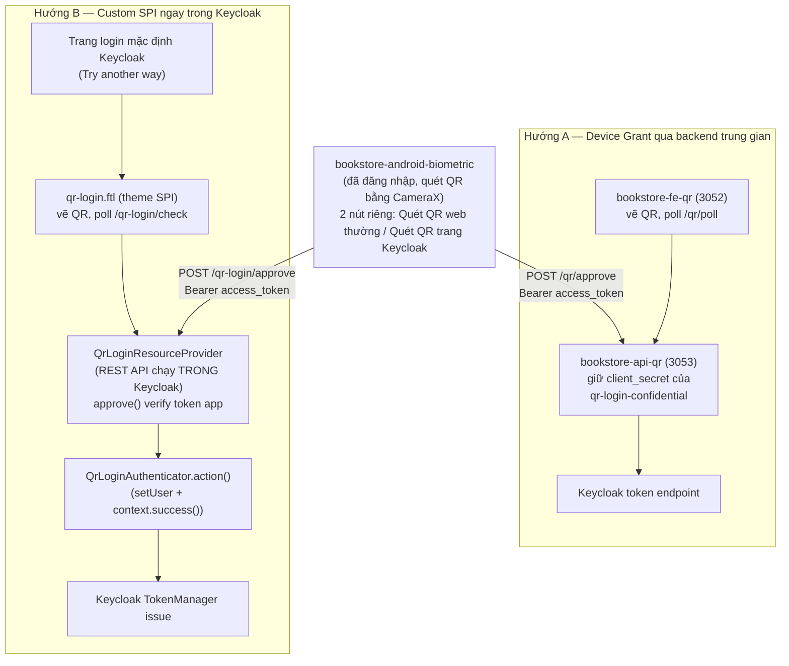
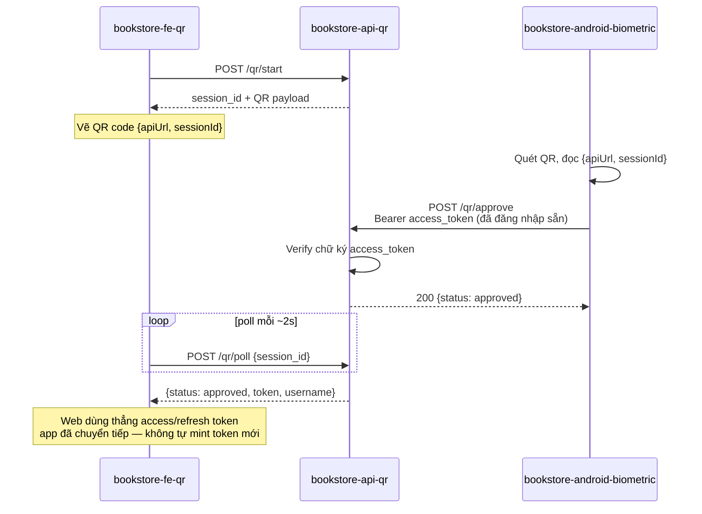
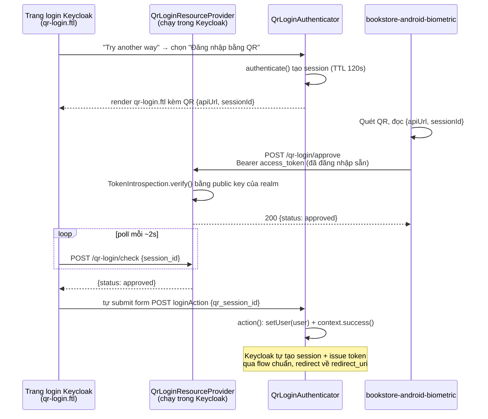

# [Keycloak Login] QR Cross-Device Login — Device Grant (Web thường) + Custom SPI (Trang login Keycloak)

## Mục lục

**Phần I — Đề bài**
1. Bối cảnh và vấn đề
2. Không gian giải pháp và lý do lựa chọn
3. Phạm vi và giả định

**Phần II — Hiện thực**
4. Kiến trúc hệ thống
5. Hướng A — Device Grant qua backend trung gian (**bookstore-fe-qr** / **bookstore-api-qr**)
6. Hướng B — Custom SPI ngay trên trang login Keycloak (**keycloak-spi-qr-login**)
7. Android — 2 nút quét QR riêng biệt

**Phần III — Kết quả**
8. Kết quả kiểm chứng
9. So sánh hai hướng
10. Đánh giá bảo mật
11. Kết luận

---

# Phần I — Đề bài

## 1. Bối cảnh và vấn đề

### 1.1 Hiện trạng

Hệ thống demo có nhiều app web chạy trên các thiết bị khác nhau (máy tính, máy chủ demo…),
tất cả xác thực qua Keycloak bằng form username/password mặc định. Khi người dùng đã có
sẵn một phiên đăng nhập hợp lệ trên điện thoại (app Android **bookstore-android-biometric**),
họ vẫn phải gõ lại username/password mỗi khi mở một trang web mới trên thiết bị khác —
giống hệt trải nghiệm "Đăng nhập bằng QR" của WhatsApp Web/Web Banking.

### 1.2 Câu hỏi đặt ra

> Có thể để người dùng đăng nhập vào một trang web trên **thiết bị khác** (máy tính) chỉ bằng
> cách quét QR từ điện thoại đã đăng nhập sẵn, mà không cần gõ lại mật khẩu, và không cần
> viết lại toàn bộ hạ tầng đăng nhập hiện có?

## 2. Không gian giải pháp và lý do lựa chọn

### 2.1 Các phương án đã cân nhắc

| Phương án | Cơ chế | Kết luận |
|---|---|---|
| OAuth 2.0 Device Authorization Grant (RFC 8628) chuẩn | Web hiển thị **user_code**, người dùng gõ tay vào một trang riêng trên điện thoại | ⚠️ Đúng chuẩn nhưng UX kém hơn quét QR — vẫn phải gõ 1 mã, và Keycloak yêu cầu bật **oauth2.device.authorization.grant.enabled** trên từng client |
| QR "tự-approve" qua backend trung gian | Web sinh **session_id**, app đã đăng nhập gửi thẳng access token của nó lên backend để approve, backend generate token mới cho web | ✅ Chọn — Hướng A, dành cho app/web có **UI đăng nhập riêng** (không dùng trang login của Keycloak) — kiểu Zalo, VNeID |
| Custom SPI ngay trong Keycloak | Thêm bước "Đăng nhập bằng QR" làm alternative step trên chính flow đăng nhập mặc định của Keycloak | ✅ Chọn — Hướng B, dành cho app/web **dùng thẳng UI/theme login của Keycloak** — cần sửa Keycloak theme để chèn QR vào |
| WebAuthn/Passkey cross-device (caBLE) | Dùng cơ chế "hybrid transport" chuẩn W3C, quét QR do trình duyệt tự vẽ | ❌ Loại cho phạm vi demo này — cần thiết bị hỗ trợ BLE hybrid, phức tạp hơn nhiều so với mục tiêu minh hoạ luồng QR cross-device đơn giản |

### 2.2 Vì sao chọn Hướng A — Device Grant qua backend trung gian (**bookstore-api-qr**)

**Tiêu chí quyết định chính: app/web nào tự vẽ UI đăng nhập của riêng mình, không dùng trang
login mặc định của Keycloak.** Đây là trường hợp phổ biến của các ứng dụng lớn kiểu Zalo,
VNeID — màn hình đăng nhập là một phần giao diện do chính app thiết kế (thương hiệu, bố cục,
ngôn ngữ riêng), Keycloak (hay bất kỳ IdP nào phía sau) chỉ đóng vai trò backend xác thực mà
người dùng không hề nhìn thấy trực tiếp. Với nhóm này, việc "chèn QR vào trang login của
Keycloak" (Hướng B) là bất khả thi về mặt sản phẩm — vì người dùng chẳng bao giờ thấy trang
đó — nên QR phải được vẽ ngay trong UI riêng của app/web đó, dữ liệu phiên do một backend của
chính hệ thống ấy quản lý.

- **Không phụ thuộc giao diện của Keycloak.** Toàn bộ trải nghiệm QR (vị trí đặt mã, style,
  text hướng dẫn, ngôn ngữ) do đội ngũ phát triển app/web tự quyết định 100%, không bị giới
  hạn bởi theme hay layout của Keycloak.
- **Triển khai nhanh, tách biệt hoàn toàn khỏi Keycloak.** Toàn bộ logic sinh QR, poll trạng
  thái, giữ **client_secret** nằm trong một backend Node.js độc lập (**qr-login-confidential**,
  confidential client). Không cần build/deploy lại Keycloak.
- **Không đụng cấu hình các app khác.** Trang QR là một route riêng (**/qr/approve** cho hướng
  tự-approve, **/device/*** cho Device Authorization Grant chuẩn RFC 8628) — các client OAuth
  khác trong realm hoàn toàn không biết tới sự tồn tại của nó.
- **Dễ hiểu, dễ debug.** Route Express thuần, log rõ ràng, không phải học API nội bộ của
  Keycloak.
- Chi phí: là một service riêng phải tự vận hành (port, **.env**, restart), state lưu
  in-memory chỉ chạy được 1 instance.

### 2.3 Vì sao chọn Hướng B — Custom SPI trong Keycloak (**keycloak-spi-qr-login**)

**Tiêu chí quyết định chính: app/web nào dùng thẳng giao diện login mặc định của Keycloak**
(redirect sang **/protocol/openid-connect/auth** và hiển thị nguyên trang HTML do Keycloak
render), không tự vẽ form đăng nhập riêng. Đây là trường hợp của phần lớn client nội bộ demo
trong repo này (**test-client**, **passwordless-demo**, **biometric-demo**, **test-qr-web-2**, …).
Với nhóm này, thêm QR vào ngay UI đó là hợp lý nhất — nhưng đổi lại **bắt buộc phải sửa
Keycloak theme** (thêm authenticator mới + file **.ftl** mới trong **keycloak-spi-qr-login**),
vì không có cách nào chèn thêm một bước xác thực vào trang login Keycloak mà không động vào
theme/SPI của chính nó.

Hướng B còn giải quyết đúng hạn chế lớn nhất của Hướng A khi áp dụng cho nhóm client này: QR
ở Hướng A chỉ hiện được trên **một trang web riêng** (**bookstore-fe-qr**) do phải tự vẽ UI
đăng nhập — nếu ép nhóm client "dùng UI Keycloak" phải mở thêm một trang QR tách biệt thay
vì thấy nó ngay trên trang login quen thuộc, trải nghiệm sẽ rời rạc và không tận dụng được
lợi thế "một trang login dùng chung cho mọi client" vốn có của Keycloak.

- **Dùng chung cho mọi client dùng UI Keycloak.** SPI thêm một bước **ALTERNATIVE**
  (**qr-login-authenticator**) song song với **auth-username-password-form** ngay trong Browser
  Flow mặc định — bất kỳ client OAuth nào dùng flow này đều tự động có nút "Try another way"
  → "Đăng nhập bằng QR", không cần cấu hình lại cho từng client.
- **Token do chính Keycloak issue**, dùng **TokenManager** nội bộ — không có backend trung
  gian nào giữ bản sao access token của người dùng.
- **Không cần đổi client_id.** Không giống Hướng A (phải có client **qr-login-confidential**
  riêng để mint token), phiên QR ở Hướng B gắn thẳng vào phiên login của chính client đang
  yêu cầu (**test-qr-web-2** hay bất kỳ client nào khác).
- Chi phí: phải sửa Keycloak theme (viết SPI Java + file **.ftl**), build lại và deploy vào
  Keycloak mỗi khi sửa; dùng internal API (**org.keycloak.protocol.oidc.TokenManager**) không
  đảm bảo ổn định giữa các minor version.

### 2.4 Vì sao giữ cả hai hướng song song

Hai hướng trả lời hai câu hỏi khác nhau, không thay thế nhau:

1. Hướng A trả lời: "Làm sao thêm QR login nhanh nhất mà không đụng Keycloak?"
2. Hướng B trả lời: "Làm sao QR login trở thành một lựa chọn có sẵn cho *mọi* client, ngay
   trên trang login gốc?"

Hướng A được giữ lại làm tài liệu tham khảo/đối chứng; **app Android hiện tại đã chuyển hẳn
sang gọi Hướng B** (route **/qr-login/approve**) làm đường chính.

## 3. Phạm vi và giả định POC

### 3.1 In scope
- Web QR (Hướng A): **bookstore-fe-qr** (React) + **bookstore-api-qr** (Express).
- SPI QR (Hướng B): **keycloak-spi-qr-login** (Java, Maven, Keycloak SPI) + **bookstore-fe-qr-2**
  (React, OAuth client thật để test SPI).
- App Android (**bookstore-android-biometric**) quét QR cho cả 2 luồng, với 2 nút bấm riêng.
- Cấu hình Keycloak client cho từng luồng.

### 3.2 Out scope
- Chuẩn hoá theo RFC 8628 (Device Authorization Grant) cho luồng tự-approve — luồng "tự
  approve" ở cả 2 hướng không phải Device Grant chuẩn, xem mục 5.1 và 6.1.
- Chạy nhiều node Keycloak (cluster) — session QR lưu in-memory 1 tiến trình.
- HTTPS/TLS thật — demo chạy HTTP trên IP LAN.

### 3.3 Giả định

| Giả định | Ghi chú |
|---|---|
| Điện thoại đã có phiên đăng nhập hợp lệ (access token còn hạn) trước khi quét | Cả 2 hướng đều dùng access token đó để "chứng minh danh tính", không hỏi lại mật khẩu |
| Điện thoại và web/Keycloak cùng nằm trên một mạng LAN, dùng IP LAN thay vì **localhost** | Web chạy trên máy tính, QR code phải chứa URL mà điện thoại gọi được — **localhost** trên điện thoại sẽ không resolve tới máy chạy Docker |
| Môi trường demo dùng HTTP thuần (không HTTPS) | Chấp nhận được cho demo, không cho production |

---

# Phần II — Hiện thực

## 4. Kiến trúc hệ thống

### 4.1 Tổng quan



### 4.2 Điểm khác biệt kiến trúc cốt lõi

| | Hướng A | Hướng B |
|---|---|---|
| Nơi chạy logic QR | Backend Node.js độc lập (**bookstore-api-qr**) | Trong chính tiến trình Keycloak (SPI) |
| Ai issue token cuối cùng | Backend gọi token endpoint chuẩn bằng **client_secret** | **TokenManager** nội bộ của Keycloak, không qua HTTP round-trip |
| Web hiển thị QR ở đâu | Trang React riêng (**bookstore-fe-qr**) | Ngay trên trang login mặc định của Keycloak (mọi client) |
| Client Keycloak dùng | **qr-login-confidential** (confidential, giữ secret ở backend) | Client đang thực hiện login bình thường (vd **test-qr-web-2**) |
| Verify token app gửi lên | Middleware Express tự introspect | **TokenVerifier** nội bộ Keycloak, dùng luôn public key của realm |

### 4.3 Cổng và endpoint

| Thành phần | Cổng | Route chính |
|---|---|---|
| **bookstore-fe-qr** | 3052 | trang React vẽ QR |
| **bookstore-api-qr** | 3053 | **POST /qr/start**, **POST /qr/approve**, **POST /qr/poll**, **POST /device/start**, **POST /device/poll** |
| **bookstore-fe-qr-2** | 3060 | OAuth test client thật, redirect thẳng vào Keycloak login |
| **keycloak-spi-qr-login** | chạy trong Keycloak (8080) | **POST /realms/{realm}/qr-login/start**, **/approve**, **/check**, **/poll** |

## 5. Hướng A — Device Grant qua backend trung gian

### 5.1 Nguyên lý

**bookstore-api-qr** thực ra triển khai **hai** cơ chế song song trong cùng một backend:

1. **/device/\* — Device Authorization Grant chuẩn (RFC 8628).** Backend gọi thẳng
   endpoint **.../protocol/openid-connect/auth/device** của Keycloak để lấy **user_code** +
   **device_code**, sau đó poll token endpoint bằng
   **grant_type=urn:ietf:params:oauth:grant-type:device_code**.
   Đây là route đúng chuẩn OAuth nhất, nhưng người dùng phải tự gõ **user_code** vào một trang
   xác nhận riêng của Keycloak.
2. **/qr/\* — QR "tự-approve" (không chuẩn RFC 8628).** Vì điện thoại **đã có sẵn access
   token hợp lệ** (đăng nhập trước đó bằng vân tay trong **bookstore-android-biometric**), thay
   vì bắt người dùng gõ **user_code**, app tự gửi access token của chính nó lên backend kèm
   **session_id** đọc được từ QR. Backend coi đó là bằng chứng danh tính và phát một session
   "approved" để trang web poll và nhận token. **Đây là route mà app Android thực sự dùng.**



### 5.2 Cấu hình Keycloak — client **qr-login-confidential**

```json
{
  "clientId": "qr-login-confidential",
  "description": "Backend-only client (bookstore-api-qr) driving OAuth2 Device Authorization Grant",
  "clientAuthenticatorType": "client-secret",
  "secret": "8cdb63690ed626e792c1b151c96363fc20141b8c5a755ba4",
  "publicClient": false,
  "standardFlowEnabled": false,
  "directAccessGrantsEnabled": false,
  "attributes": {
    "oauth2.device.authorization.grant.enabled": "true"
  },
  "defaultClientScopes": ["web-origins", "acr", "profile", "roles", "basic", "email"]
}
```

| Tham số | Vì sao |
|---|---|
| **publicClient: false** + **secret** | Confidential client — **client_secret** **chỉ nằm trong .env của backend**, không bao giờ tới trình duyệt/điện thoại |
| **standardFlowEnabled: false** | Client này không dùng Authorization Code — chỉ dùng Device Grant / cấp token thủ công |
| **oauth2.device.authorization.grant.enabled: true** | Bắt buộc để Keycloak chấp nhận request tới **/auth/device** cho client này |

### 5.3 **bookstore-api-qr/src/config.js** — nạp cấu hình

```javascript
require("dotenv").config({ path: require("path").join(__dirname, "..", ".env"), quiet: true });

function required(name) {
  const value = process.env[name];
  if (!value) {
    throw new Error(`Missing env var ${name} — copy .env.example thành .env rồi điền giá trị`);
  }
  return value;
}

module.exports = {
  PORT: required("PORT"),
  KEYCLOAK_URL: required("KEYCLOAK_URL"),
  REALM: required("REALM"),
  CLIENT_ID: required("CLIENT_ID"),
  CLIENT_SECRET: required("CLIENT_SECRET"),
  get ISSUER() { return `${this.KEYCLOAK_URL}/realms/${this.REALM}`; },
  get DEVICE_AUTH_ENDPOINT() { return `${this.ISSUER}/protocol/openid-connect/auth/device`; },
  get TOKEN_ENDPOINT() { return `${this.ISSUER}/protocol/openid-connect/token`; },
  get JWKS_URI() { return `${this.ISSUER}/protocol/openid-connect/certs`; },
};
```

Fail-fast bằng hàm **required()**: thiếu bất kỳ biến môi trường nào là báo lỗi ngay khi khởi
động thay vì lỗi mơ hồ lúc runtime — đúng nguyên nhân của lỗi "port 3052 bật không lên"
từng gặp khi **.env** bị thiếu/sai.

### 5.4 **bookstore-api-qr/src/routes/qrSession.js** — luồng QR tự-approve

```javascript
const SESSION_TTL_MS = 2 * 60 * 1000;
const sessions = new Map(); // in-memory — chỉ chạy được 1 instance

// POST /qr/start — web gọi khi hiện mã QR
router.post("/start", (req, res) => {
  cleanupExpired();
  const sessionId = crypto.randomBytes(16).toString("hex");
  sessions.set(sessionId, {
    status: "pending",
    expiresAt: Date.now() + SESSION_TTL_MS,
    token: null,
  });
  res.json({ session_id: sessionId, expires_in: SESSION_TTL_MS / 1000 });
});

// POST /qr/approve — app gọi sau khi quét QR, kèm access_token của app trong header
router.post("/approve", requireToken, (req, res) => {
  const { session_id, access_token, refresh_token, expires_in, token_type, scope } = req.body;
  const session = sessions.get(session_id);

  if (!session) return res.status(404).json({ error: "not_found" });
  if (session.status !== "pending") return res.status(409).json({ error: "already_used" });
  if (!access_token) return res.status(400).json({ error: "invalid_request" });

  session.status = "approved";
  session.token = { access_token, refresh_token, expires_in, token_type, scope };
  session.username = req.tokenInfo.preferred_username || req.tokenInfo.sub;
  res.json({ status: "approved" });
});

// POST /qr/poll — web gọi lặp lại để chờ app approve, trả 1 lần rồi xoá (chống replay)
router.post("/poll", (req, res) => {
  const session = sessions.get(req.body.session_id);
  if (!session) return res.status(404).json({ status: "expired" });
  if (session.status === "pending") return res.json({ status: "pending" });

  const { token, username } = session;
  sessions.delete(req.body.session_id);
  res.json({ status: "approved", token, username });
});
```

Điểm mấu chốt: route **/qr/approve** **không tự mint token mới** — nó chỉ chuyển tiếp nguyên vẹn
access/refresh token mà app Android gửi lên cho trang web dùng. Middleware **requireToken**
verify chữ ký token đó trước khi tin, đảm bảo không ai giả mạo **access_token** rác.

### 5.5 **bookstore-api-qr/src/routes/device.js** — Device Authorization Grant chuẩn (route dự phòng)

```javascript
function basicAuthHeader() {
  return `Basic ${Buffer.from(`${config.CLIENT_ID}:${config.CLIENT_SECRET}`).toString("base64")}`;
}

// FE gọi trước để lấy user_code/QR — client_secret không bao giờ rời khỏi backend.
router.post("/start", async (req, res) => {
  const response = await fetch(config.DEVICE_AUTH_ENDPOINT, {
    method: "POST",
    headers: { "Content-Type": "application/x-www-form-urlencoded", Authorization: basicAuthHeader() },
    body: new URLSearchParams({ client_id: config.CLIENT_ID }),
  });
  res.json(await response.json());
});

// FE poll theo "interval" trả về ở /start cho tới khi có token hoặc hết hạn.
router.post("/poll", async (req, res) => {
  const response = await fetch(config.TOKEN_ENDPOINT, {
    method: "POST",
    headers: { "Content-Type": "application/x-www-form-urlencoded", Authorization: basicAuthHeader() },
    body: new URLSearchParams({
      grant_type: "urn:ietf:params:oauth:grant-type:device_code",
      device_code: req.body.device_code,
    }),
  });
  // Keycloak trả 400 + error=authorization_pending/slow_down trong lúc chờ — trạng thái
  // bình thường của polling, không phải lỗi thật, nên luôn forward nguyên trạng cho FE.
  res.status(response.status).json(await response.json());
});
```

Route này giữ nguyên **client_secret** phía backend — không bao giờ gửi xuống trình duyệt —
đúng nguyên tắc bảo mật cho confidential client, nhưng **không phải luồng đang được app dùng
thực tế** (app dùng **/qr/\***).

### 5.6 **.env** — vì sao phải dùng IP LAN thay vì **localhost**

```
PORT=3052
# Backend trung gian giữ client_secret (xem ../bookstore-api-qr) — dùng IP LAN vì QR code
# encode apiUrl này để điện thoại thật gọi tới, localhost trên điện thoại sẽ không resolve
# được máy chạy Docker.
REACT_APP_API_URL=http://192.168.0.233:3053
REACT_APP_BOOKS_API_URL=http://192.168.0.233:3043
```

Bug thực tế gặp phải: **.env** từng để **localhost**, QR code vẫn vẽ ra và web vẫn chạy bình
thường trên máy tính (vì **localhost** trên chính máy đó hợp lệ) — nhưng điện thoại quét QR
sẽ cố gọi **http://localhost:3053** của **chính điện thoại**, không resolve được tới máy tính
đang chạy Docker. Lỗi này im lặng ở phía web, chỉ lộ ra khi test bằng thiết bị thật.

## 6. Hướng B — Custom SPI ngay trên trang login Keycloak

### 6.1 Nguyên lý

SPI thêm một Authenticator mới (**qr-login-authenticator**) làm bước **ALTERNATIVE** song
song với **auth-username-password-form** trong Browser Flow mặc định của Keycloak. Khi người
dùng bấm "Try another way" trên trang login và chọn "Đăng nhập bằng QR (Cross-Device)":

1. Hàm **authenticate()** của **QrLoginAuthenticator** tạo một session mới trong
   **QrLoginSessionStore** (in-memory, TTL 120 giây) và render **qr-login.ftl** — theme Freemarker
   riêng vẽ QR code bằng **qrcode.min.js** ngay trên trang login gốc.
2. QR code encode **{"apiUrl": "<realm base URL>", "sessionId": "<id>"}**.
3. Trang login tự poll route **POST /realms/{realm}/qr-login/check** mỗi 2 giây để hỏi trạng
   thái — **không** issue token ở bước này, chỉ hỏi "đã approved chưa".
4. Điện thoại (đã đăng nhập sẵn) quét QR, gọi route **POST /realms/{realm}/qr-login/approve**
   kèm header **Authorization: Bearer <access_token của chính nó>**.
5. Trang login thấy **check** trả **approved** → tự submit ẩn form
   **POST ${url.loginAction}** (kèm **qr_session_id**) → gọi lại đúng
   hàm **action()** của **QrLoginAuthenticator** trong flow chuẩn của Keycloak.
6. **action()** xác nhận session đã approved, gọi **context.setUser(user)** +
   **context.success()** — **Keycloak tự lo phần còn lại** (tạo session, issue token, redirect
   về **redirect_uri** của client) y hệt như authenticate bằng mật khẩu thành công.

Điểm khác biệt cốt lõi so với Hướng A: bước 6 không có bước mint token thủ công nào cả — vì
QR ở đây gắn liền vào chính luồng Authorization Code của client đang login (**test-qr-web-2**
hay bất kỳ client nào), Keycloak tự mint token theo đúng flow chuẩn của client đó.

**QrLoginResourceProvider** còn có route **poll** (dùng **TokenIssuer** tự mint token cho client
cố định **qr-login-confidential**) — đây là phần **port thử nghiệm** từ luồng Node.js cũ sang
chạy trong Keycloak, giữ lại để tham khảo nhưng **không phải đường đi thực tế** của
**qr-login.ftl** (trang login dùng **check** + tự submit form, không dùng **poll**).



### 6.2 **QrLoginAuthenticatorFactory** — đăng ký authenticator vào Keycloak

```java
public class QrLoginAuthenticatorFactory implements AuthenticatorFactory {
    public static final String ID = "qr-login-authenticator";
    private static final QrLoginAuthenticator SINGLETON = new QrLoginAuthenticator();
    private static final AuthenticationExecutionModel.Requirement[] REQUIREMENT_CHOICES = {
            AuthenticationExecutionModel.Requirement.ALTERNATIVE,
            AuthenticationExecutionModel.Requirement.DISABLED,
    };

    @Override public String getId() { return ID; }
    @Override public String getDisplayType() { return "Đăng nhập bằng QR (Cross-Device)"; }
    @Override public boolean isConfigurable() { return false; }
    @Override public AuthenticationExecutionModel.Requirement[] getRequirementChoices() {
        return REQUIREMENT_CHOICES;
    }
    @Override public Authenticator create(KeycloakSession session) { return SINGLETON; }
}
```

Chỉ cho phép **ALTERNATIVE**/**DISABLED** (không có **REQUIRED**) — đúng ý đồ thiết kế: QR luôn là
một *lựa chọn thay thế* cho mật khẩu, không bao giờ được ép buộc bắt buộc.

### 6.3 **QrLoginAuthenticator** — **authenticate()** và **action()**

```java
public class QrLoginAuthenticator implements Authenticator {
    static final String SESSION_ID_PARAM = "qr_session_id";

    @Override
    public void authenticate(AuthenticationFlowContext context) {
        QrLoginSessionStore.Session qrSession = QrLoginSessionStore.getInstance().createSession();
        var form = context.form()
                .setAttribute("qrSessionId", qrSession.id)
                .setAttribute("qrExpiresIn", QrLoginSessionStore.TTL_SECONDS);
        context.challenge(form.createForm("qr-login.ftl"));
    }

    @Override
    public void action(AuthenticationFlowContext context) {
        String sessionId = context.getHttpRequest().getDecodedFormParameters().getFirst(SESSION_ID_PARAM);
        QrLoginSessionStore store = QrLoginSessionStore.getInstance();
        QrLoginSessionStore.Session qrSession = store.get(sessionId);

        if (qrSession == null || !"approved".equals(qrSession.status)) {
            context.challenge(context.form()
                    .setAttribute("qrSessionId", sessionId)
                    .setError("Phiên QR chưa được xác nhận hoặc đã hết hạn")
                    .createForm("qr-login.ftl"));
            return;
        }

        UserModel user = context.getSession().users().getUserById(context.getRealm(), qrSession.userId);
        store.remove(sessionId);

        if (user == null) {
            context.challenge(context.form().setError("Không tìm thấy người dùng đã xác nhận QR")
                    .createForm("qr-login.ftl"));
            return;
        }

        context.setUser(user);
        context.success(); // Keycloak tự tạo session + issue token từ đây
    }

    @Override public boolean requiresUser() { return false; } // chưa biết user tới khi approve
}
```

**requiresUser() = false** là bắt buộc: ở bước **authenticate()**, Keycloak chưa biết đây là ai
— danh tính chỉ được xác định sau khi điện thoại approve ở bước **action()**.

### 6.4 **QrLoginResourceProvider** — REST API chạy trong tiến trình Keycloak

```java
public class QrLoginResourceProvider implements RealmResourceProvider {

    @POST @Path("start") @Produces(MediaType.APPLICATION_JSON)
    public Response start() {
        var created = QrLoginSessionStore.getInstance().createSession();
        return Response.ok(Map.of("session_id", created.id, "expires_in", QrLoginSessionStore.TTL_SECONDS)).build();
    }

    @POST @Path("approve") @Consumes(MediaType.APPLICATION_JSON) @Produces(MediaType.APPLICATION_JSON)
    public Response approve(Map<String, Object> body, @Context HttpHeaders headers) {
        String authHeader = headers.getHeaderString("Authorization");
        if (authHeader == null || !authHeader.startsWith("Bearer ")) {
            return errorResponse(Response.Status.UNAUTHORIZED, "unauthorized", "Missing Authorization: Bearer <token>");
        }
        String accessToken = authHeader.substring("Bearer ".length());
        String sessionId = (String) body.get("session_id");

        TokenIntrospection.Result introspected;
        try {
            introspected = TokenIntrospection.verify(session, accessToken);
        } catch (Exception e) {
            return errorResponse(Response.Status.UNAUTHORIZED, "unauthorized", "Token không hợp lệ: " + e.getMessage());
        }

        QrLoginSessionStore store = QrLoginSessionStore.getInstance();
        var qrSession = store.get(sessionId);
        if (qrSession == null) return errorResponse(Response.Status.NOT_FOUND, "not_found", "...");
        if (!"pending".equals(qrSession.status)) return errorResponse(Response.Status.CONFLICT, "already_used", "...");

        boolean approved = store.approve(sessionId, introspected.userId(), introspected.username(), accessToken);
        if (!approved) return errorResponse(Response.Status.CONFLICT, "already_used", "...");

        return Response.ok(Map.of("status", "approved")).build();
    }

    // POST /qr-login/check — trang login gọi lặp lại chỉ để biết đã approved chưa,
    // KHÔNG issue token và KHÔNG xoá session (khác /poll) — sau khi thấy approved=true,
    // trang login tự submit form để Authenticator.action() xử lý tiếp trong flow chuẩn.
    @POST @Path("check") @Consumes(MediaType.APPLICATION_JSON) @Produces(MediaType.APPLICATION_JSON)
    public Response check(Map<String, Object> body) {
        var qrSession = QrLoginSessionStore.getInstance().get((String) body.get("session_id"));
        if (qrSession == null) return Response.status(Response.Status.NOT_FOUND).entity(Map.of("status", "expired")).build();
        return Response.ok(Map.of("status", qrSession.status)).build();
    }
}
```

Route **POST /realms/{realm}/qr-login/\*** được Keycloak tự expose ra ngoài nhờ implement
interface **RealmResourceProvider** — không cần cấu hình reverse proxy hay servlet thủ công nào
khác, đây là cơ chế SPI chuẩn của Keycloak cho việc "gắn thêm REST endpoint vào realm URL".

### 6.5 **TokenIntrospection** — verify token app gửi lên, không round-trip mạng

```java
final class TokenIntrospection {
    record Result(String userId, String username) {}

    static Result verify(KeycloakSession session, String accessToken) throws Exception {
        RealmModel realm = session.getContext().getRealm();
        AccessToken token = TokenVerifier.create(accessToken, AccessToken.class)
                .withChecks(TokenVerifier.IS_ACTIVE, new TokenVerifier.RealmUrlCheck(
                        Urls.realmIssuer(session.getContext().getUri().getBaseUri(), realm.getName())))
                .publicKey(session.keys().getActiveRsaKey(realm).getPublicKey())
                .verify()
                .getToken();

        if (token.getSubject() == null) throw new IllegalArgumentException("Token thiếu subject");
        return new Result(token.getSubject(), token.getPreferredUsername());
    }
}
```

Khác biệt lớn nhất với Hướng A: vì code này **chạy ngay trong tiến trình Keycloak**, nó dùng
thẳng public key đang hoạt động của realm (**session.keys().getActiveRsaKey(realm)**) — không
cần gọi HTTP tới JWKS endpoint (**bookstore-api-qr** phải làm vậy vì nó là process ngoài).

### 6.6 **TokenIssuer** — mint token nội bộ (dùng cho route **poll**, không phải đường chính)

```java
final class TokenIssuer {
    private static final String QR_CLIENT_ID = "qr-login-confidential";

    static AccessTokenResponse issueFor(KeycloakSession session, String userId) {
        UserModel user = session.users().getUserById(realm, userId);
        ClientModel client = realm.getClientByClientId(QR_CLIENT_ID);

        // TokenManager/protocol mappers đọc session.getContext().getClient() — request tới
        // custom REST resource này không tự set nó như token endpoint chuẩn đã làm.
        session.getContext().setClient(client);

        UserSessionModel userSession = session.sessions().createUserSession(
                realm, user, user.getUsername(), "0.0.0.0", "qr-login-spi", false, null, null);
        AuthenticatedClientSessionModel clientSession = session.sessions().createClientSession(realm, client, userSession);
        clientSession.setProtocol(OIDCLoginProtocol.LOGIN_PROTOCOL);

        var clientSessionCtx = DefaultClientSessionContext.fromClientSessionAndScopeParameter(
                clientSession, "openid profile email", session);

        TokenManager tokenManager = new TokenManager();
        return tokenManager.responseBuilder(realm, client, event, session, userSession, clientSessionCtx)
                .generateAccessToken().generateRefreshToken().generateIDToken()
                .build();
    }
}
```

Ghi chú quan trọng để lại trong code: đây là **internal API**
(**org.keycloak.protocol.oidc.\***, **org.keycloak.services.util.\***), không phải public API ổn
định — có thể đổi giữa các minor version của Keycloak. Route **check** + tự submit form (mục
6.4) tránh được rủi ro này hoàn toàn vì nó để Keycloak tự issue token qua flow chuẩn thay vì
gọi **TokenManager** thủ công.

### 6.7 **qr-login.ftl** — theme vẽ QR ngay trên trang login Keycloak

```html
<#import "template.ftl" as layout>
<@layout.registrationLayout displayMessage=true; section>
    <#if section = "form">
        <div id="qr-login-container" style="text-align:center;">
            <p>Mở app trên điện thoại đã đăng nhập, chọn <b>Quét mã QR</b> để đăng nhập thiết bị này.</p>
            <canvas id="qr-canvas"></canvas>
            <p id="qr-status">Đang chờ quét mã…</p>
            <form id="kc-qr-form" action="${url.loginAction}" method="post" style="display:none;">
                <input type="hidden" id="qr-session-id-input" name="qr_session_id" value="${qrSessionId}"/>
            </form>
        </div>
        <script src="${url.resourcesPath}/js/qrcode.min.js"></script>
        <script>
            (function () {
                var sessionId = "${qrSessionId}";
                var qrLoginBase = /* base URL realm hiện tại */ + "/qr-login";
                var qrPayload = JSON.stringify({ apiUrl: realmBaseUrl, sessionId: sessionId });
                QRCode.toCanvas(document.getElementById("qr-canvas"), qrPayload, { width: 240 });

                var timer = setInterval(function () {
                    fetch(qrLoginBase + "/check", {
                        method: "POST", headers: { "Content-Type": "application/json" },
                        body: JSON.stringify({ session_id: sessionId })
                    })
                    .then(r => r.json())
                    .then(data => {
                        if (data.status === "approved") {
                            clearInterval(timer);
                            document.getElementById("kc-qr-form").submit();
                        }
                    });
                }, 2000);
            })();
        </script>
    </#if>
</@layout.registrationLayout>
```

Đây là toàn bộ phần frontend của Hướng B — không có React/build step nào, chỉ là một theme
Freemarker + JS thuần được Keycloak tự phục vụ, vì nó phải render *bên trong* trang login
gốc của Keycloak (dùng chung **template.ftl**, CSS, layout hiện có) thay vì là một trang độc
lập như Hướng A.

### 6.8 **QrLoginSessionStore** — lưu trạng thái phiên, TTL 120 giây

```java
final class QrLoginSessionStore {
    static final long TTL_SECONDS = 120;
    private final Map<String, Session> sessions = new ConcurrentHashMap<>();

    static final class Session {
        volatile String status = "pending"; // pending | approved
        volatile String userId;
        volatile String username;
    }

    boolean approve(String id, String userId, String username, String ignoredAccessToken) {
        Session session = get(id);
        if (session == null || !"pending".equals(session.status)) return false;
        synchronized (session) {
            if (!"pending".equals(session.status)) return false; // chặn race 2 request approve cùng lúc
            session.status = "approved";
            session.userId = userId;
            session.username = username;
        }
        return true;
    }
}
```

**ConcurrentHashMap** kết hợp khối **synchronized (session)** bên trong **approve()** chặn race
condition khi 2 request **approve** tới gần như đồng thời (vd người dùng bấm nhầm 2 lần) — chỉ
request đầu tiên thắng, request sau nhận **already_used**.

**Giới hạn đã biết**: giống hệt Hướng A, đây là **static Map** trong 1 JVM — mất khi Keycloak
restart, không chia sẻ được giữa nhiều node Keycloak (cluster). Production cần chuyển sang
Infinispan cache (Keycloak đã có sẵn hạ tầng cache này cho các mục đích khác).

### 6.9 **bookstore-fe-qr-2** — client OAuth thật để test SPI end-to-end

Vì QR ở Hướng B chỉ xuất hiện trên trang login mặc định của Keycloak, cần một OAuth client
**thật** (Authorization Code + PKCE) để có trang login đó thay vì tự vẽ QR như Hướng A.

```json
{
  "clientId": "test-qr-web-2",
  "publicClient": true,
  "standardFlowEnabled": true,
  "directAccessGrantsEnabled": false,
  "redirectUris": ["http://localhost:3060/*", "http://192.168.0.233:3060/*"],
  "attributes": {
    "pkce.code.challenge.method": "S256",
    "post.logout.redirect.uris": "+"
  }
}
```

**bookstore-fe-qr-2/src/services/authService.ts** chỉ làm đúng 2 việc: điều hướng sang
endpoint **/protocol/openid-connect/auth** (nơi trang login SPI xuất hiện) và đổi **code** lấy
token — không có logic QR nào ở phía React, toàn bộ nằm trong theme **qr-login.ftl**.

```typescript
export function logout(idToken?: string): void {
  const params = new URLSearchParams({
    client_id: CLIENT_ID,
    post_logout_redirect_uri: `${window.location.origin}/`,
  });
  if (idToken) params.set("id_token_hint", idToken);
  window.location.href = `${REALM_URL}/protocol/openid-connect/logout?${params.toString()}`;
}
```

Logout dùng RP-Initiated Logout chuẩn OIDC — cần **post.logout.redirect.uris** được khai báo
trên client (giá trị **"+"** nghĩa là dùng chung whitelist với **redirectUris**), nếu không Keycloak
từ chối redirect sau khi logout.

## 7. Android — 2 nút quét QR riêng biệt

### 7.1 Lý do có 2 nút thay vì tự nhận diện QR

Cả 2 luồng dùng chung định dạng JSON **{"apiUrl": ..., "sessionId": ...}** — chỉ khác ở base
URL (**bookstore-api-qr** cho Hướng A vs domain Keycloak realm cho Hướng B) và path approve
cuối cùng (**/qr/approve** vs **/qr-login/approve**). Vì không có cách nào phân biệt chắc chắn
100% chỉ từ nội dung QR, quyết định thiết kế là để **người dùng tự chọn đúng nút** tương ứng
với UI đang hiển thị trên thiết bị kia, thay vì cố tự động suy luận.

### 7.2 **QrLoginApi.kt** — enum chọn route approve

```kotlin
enum class QrLoginMode(val approvePath: String) {
    LEGACY("/qr/approve"),
    KEYCLOAK_SPI("/qr-login/approve"),
}

class QrLoginApi {
    suspend fun approve(
        mode: QrLoginMode,
        apiUrl: String,
        sessionId: String,
        accessToken: String,
        refreshToken: String?,
        expiresIn: Int?,
        scope: String?,
    ): Result<Unit> {
        val body = json.encodeToString(QrApproveRequest.serializer(), QrApproveRequest(
            session_id = sessionId, access_token = accessToken, refresh_token = refreshToken,
            expires_in = expiresIn, token_type = "Bearer", scope = scope,
        ))
        val request = Request.Builder()
            .url("$apiUrl${mode.approvePath}")
            .header("Authorization", "Bearer $accessToken")
            .post(body.toRequestBody(jsonMediaType))
            .build()
        // ... execute, map lỗi HTTP thành Result.failure
    }
}
```

### 7.3 **AppViewModel.kt** — state machine biết đang quét cho luồng nào

```kotlin
data class LoggedIn(
    val username: String,
    // null = không quét; khác null cho biết đang quét cho nguồn QR nào (web thường hay
    // trang login Keycloak) để gọi đúng endpoint approve.
    val scanningQrMode: QrLoginMode? = null,
    val qrApproveResult: QrApproveResult? = null,
    ...
) : UiState

fun onScanQrClicked(mode: QrLoginMode) {
    val current = (_uiState.value as? UiState.LoggedIn) ?: return
    _uiState.value = current.copy(scanningQrMode = mode)
}

fun onQrCodeScanned(rawValue: String) {
    val current = (_uiState.value as? UiState.LoggedIn) ?: return
    val mode = current.scanningQrMode ?: return
    // parse rawValue thành {apiUrl, sessionId}, gọi qrLoginApi.approve(mode = mode, ...)
    // bằng accessToken hiện có — KHÔNG mở Custom Tabs, không hỏi lại mật khẩu.
}
```

### 7.4 UI — **BooksScreen** trong **MainActivity.kt**

```kotlin
OutlinedButton(
    onClick = { onScanQrClick(QrLoginMode.LEGACY) },
    modifier = Modifier.fillMaxWidth(),
) {
    Text("Quét QR trên trang web thường")
}
Spacer(Modifier.height(8.dp))
OutlinedButton(
    onClick = { onScanQrClick(QrLoginMode.KEYCLOAK_SPI) },
    modifier = Modifier.fillMaxWidth(),
) {
    Text("Quét QR trên trang đăng nhập Keycloak")
}
```

Người dùng bấm đúng nút tương ứng với nơi QR đang hiển thị (**bookstore-fe-qr** hay trang
login Keycloak của **bookstore-fe-qr-2**), camera mở lên quét, app tự gọi endpoint approve
tương ứng bằng access token nó đang giữ — không có bước xác nhận nào khác trên điện thoại.

---

# Phần III — Kết quả

## 8. Kết quả kiểm chứng

### 8.1 QR login "tự-approve" chạy được mà không cần Device Grant chuẩn

✅ Đúng, cho cả 2 hướng. Vì điện thoại đã có access token hợp lệ sẵn, việc bắt người dùng gõ
**user_code** (như RFC 8628 chuẩn) là dư thừa — gửi thẳng access token đó lên backend/SPI kèm
**session_id** đủ để chứng minh danh tính, giảm 1 bước thao tác so với Device Grant gốc.

### 8.2 SPI có thể thêm bước xác thực mới mà không viết lại flow

✅ Đúng. **qr-login-authenticator** chỉ là 1 execution **ALTERNATIVE** thêm vào Browser Flow có
sẵn — không cần định nghĩa lại toàn bộ flow, không ảnh hưởng **auth-username-password-form**
hay **auth-cookie** đang chạy song song.

### 8.3 Token do Keycloak issue qua flow chuẩn không cần TokenManager thủ công

✅ Đúng — và tốt hơn dự kiến ban đầu. Thiết kế đầu (route **poll** + **TokenIssuer**) dùng
**TokenManager** nội bộ, phụ thuộc API không ổn định. Thiết kế cuối cùng (route **check** + tự
submit form + **action()** + **context.success()**) để Keycloak tự làm toàn bộ phần issue
token, loại bỏ hẳn rủi ro đó — đây là điểm cải tiến quan trọng nhất so với bản port đầu tiên
từ Node.js.

### 8.4 Một app Android phục vụ được cả 2 kiến trúc song song

✅ Đúng. Chỉ cần 1 tham số khác nhau (**approvePath** của **QrLoginMode**) giữa 2 luồng — phần còn
lại (UI quét QR bằng CameraX, gửi access token hiện có, xử lý kết quả) dùng chung 100% code.

## 9. So sánh hai hướng

| Tiêu chí | A — Backend trung gian | B — Custom SPI |
|---|---|---|
| Nơi hiển thị QR | Trang React riêng | Ngay trên trang login Keycloak (mọi client) |
| Cần build lại Keycloak? | Không | Có (Maven build + deploy .jar) |
| Client Keycloak cần thêm | 1 confidential client (**qr-login-confidential**) | 0 — dùng client đang login |
| Nơi giữ **client_secret** | Backend Node.js (**.env**) | Không cần — không có confidential client mới |
| Ai issue token | Backend gọi token endpoint qua HTTP | Keycloak tự issue qua **Authenticator.success()** |
| Áp dụng cho client khác | Phải tích hợp thủ công từng trang | Tự động có sẵn cho mọi client dùng Browser Flow |
| Độ phức tạp triển khai | Thấp (1 service Express) | Cao (SPI Java, theme Freemarker, Maven, rebuild Keycloak) |
| Phụ thuộc internal API Keycloak | Không | Có (**TokenManager**, **TokenVerifier** — không ổn định giữa version) |
| Trạng thái hiện tại | Giữ tham khảo, Android không còn gọi | Đường chính, Android gọi mặc định |

### 9.1 Kết luận so sánh

- Hướng A mạnh ở chỗ hướng B yếu: triển khai nhanh, không đụng Keycloak, dễ debug.
- Hướng B mạnh ở chỗ hướng A yếu: dùng chung được cho mọi client, tích hợp liền mạch vào UX
  đăng nhập gốc, không cần trang QR riêng.

## 10. Đánh giá bảo mật

| Đánh giá | Chi tiết |
|---|---|
| ✅ | Access token app gửi lên đều được verify chữ ký trước khi tin (Hướng A: middleware Express; Hướng B: **TokenVerifier** với public key của realm) |
| ✅ | Session QR có TTL ngắn (120s) và bị xoá/đổi trạng thái ngay sau khi dùng — chống replay |
| ✅ | **qr-login-confidential** (Hướng A) là confidential client, **client_secret** không rời khỏi backend |
| ⚠️ | Session QR lưu in-memory (**Map**/**ConcurrentHashMap**) — mất khi restart, không hoạt động đúng trên cluster nhiều node |
| ⚠️ | **TokenIssuer**/route **poll** (Hướng B) dùng internal API không ổn định giữa các minor version Keycloak — nên tránh dùng route này, ưu tiên đường **check** + **action()** |
| ⚠️ | Không có bước xác nhận thêm trên điện thoại (vd hiển thị "Đăng nhập vào thiết bị X?") — approve xảy ra ngay khi quét, không có cơ hội huỷ nếu quét nhầm QR |
| ⚠️ | Demo chạy HTTP thuần trên IP LAN, không HTTPS — production bắt buộc TLS |

## 11. Kết luận

Cả 2 hướng đều hiện thực đầy đủ và chạy thật trên thiết bị vật lý (Android quét QR, web
nhận token, đăng nhập thành công), cùng khai thác một ý tưởng cốt lõi: tận dụng access token
đã có sẵn trên điện thoại làm bằng chứng danh tính, bỏ qua bước gõ **user_code** của Device
Grant chuẩn.

Ba kết luận chính:

1. **QR "tự-approve" bằng access token có sẵn là một biến thể hợp lý của Device Grant**,
   đánh đổi một phần tính chuẩn hoá (không đúng RFC 8628) để giảm ma sát UX — người dùng chỉ
   quét, không gõ mã.
2. **Đưa logic QR vào SPI (Hướng B) là bước tiến đúng hướng cho hệ thống nhiều client**: chi
   phí tích hợp ban đầu cao hơn (viết SPI, build Keycloak), nhưng đổi lại mọi OAuth client
   hiện có và tương lai đều tự động có QR login mà không cần sửa gì — đúng như mục tiêu ban
   đầu "không đụng cấu hình của các app đang chạy".
3. **Để Keycloak tự issue token qua flow chuẩn (context.success()) an toàn hơn gọi
   TokenManager thủ công.** Đây là bài học quan trọng nhất rút ra khi port từ Node.js
   (Hướng A) sang SPI (Hướng B): thiết kế đầu tiên sao chép logic "issue token thủ công" của
   Node.js, thiết kế cuối cùng bỏ hẳn cách đó để tận dụng đúng cơ chế Authenticator có sẵn
   của Keycloak.
