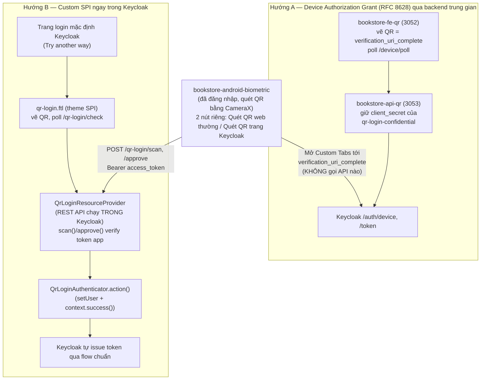
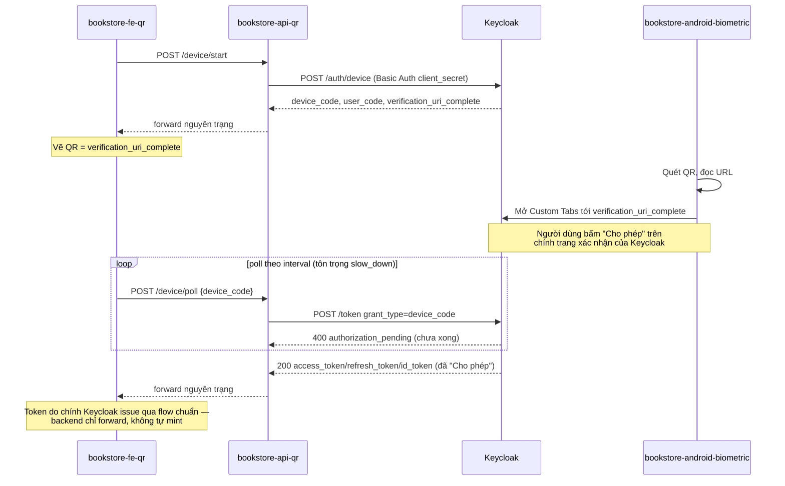
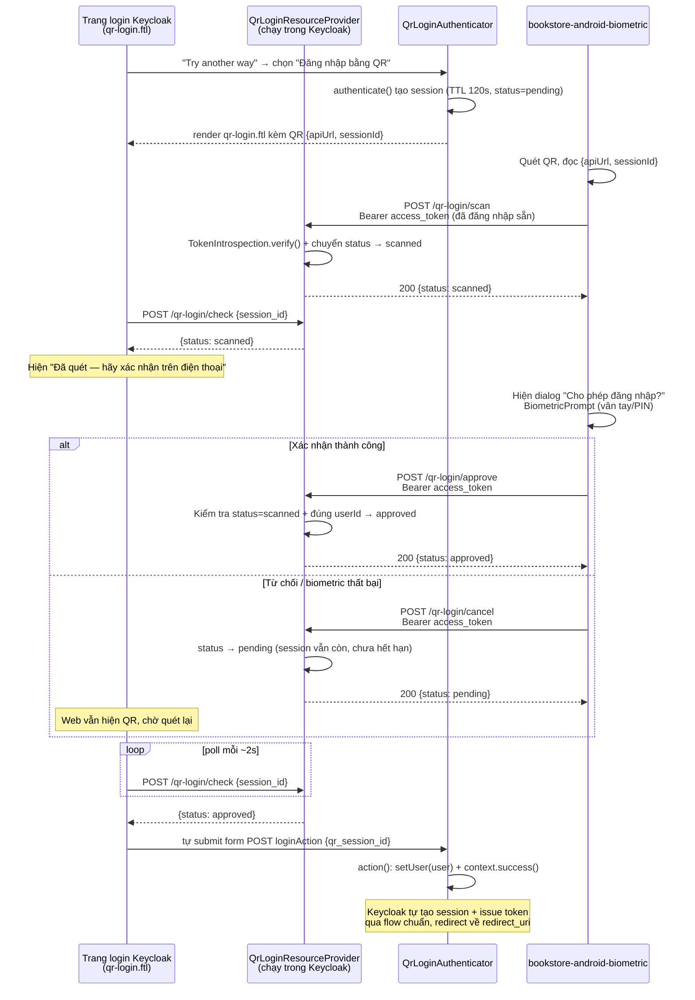
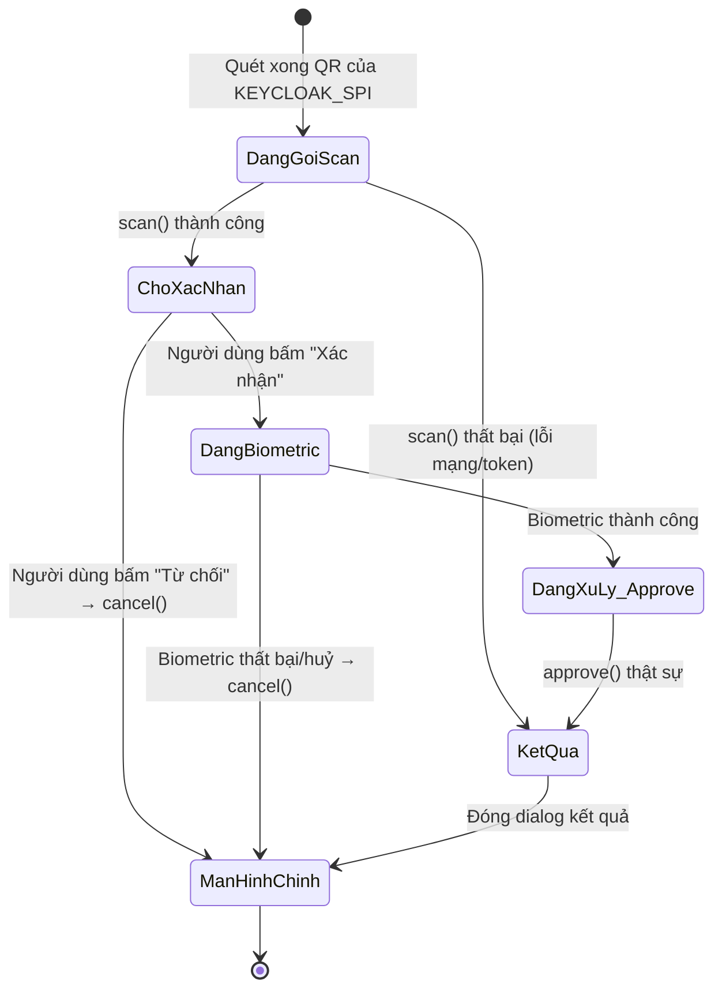

# [Keycloak Login] QR Cross-Device Login — Device Authorization Grant (Web thường) + Custom SPI (Trang login Keycloak)

## Mục lục

**Phần I — Đề bài**
1. Bối cảnh và vấn đề
2. Không gian giải pháp và lý do lựa chọn
3. Phạm vi và giả định

**Phần II — Hiện thực**
4. Kiến trúc hệ thống
5. Hướng A — Device Authorization Grant qua backend trung gian (**bookstore-fe-qr** / **bookstore-api-qr**)
6. Hướng B — Custom SPI ngay trên trang login Keycloak (**keycloak-spi-qr-login**)
7. Android — 2 nút quét QR riêng biệt

**Phần III — Kết quả**
8. Kết quả kiểm chứng
9. So sánh hai hướng
10. Đánh giá bảo mật
11. Kết luận

---

# Phần I — Đề bài

## 1. Bối cảnh và vấn đề

### 1.1 Hiện trạng

Hệ thống demo có nhiều app web chạy trên các thiết bị khác nhau (máy tính, máy chủ demo…),
tất cả xác thực qua Keycloak bằng form username/password mặc định. Khi người dùng đã có
sẵn một phiên đăng nhập hợp lệ trên điện thoại (app Android **bookstore-android-biometric**),
họ vẫn phải gõ lại username/password mỗi khi mở một trang web mới trên thiết bị khác —
giống hệt trải nghiệm "Đăng nhập bằng QR" của WhatsApp Web/Web Banking.

### 1.2 Câu hỏi đặt ra

> Có thể để người dùng đăng nhập vào một trang web trên **thiết bị khác** (máy tính) chỉ bằng
> cách quét QR từ điện thoại đã đăng nhập sẵn, mà không cần gõ lại mật khẩu, và không cần
> viết lại toàn bộ hạ tầng đăng nhập hiện có?

## 2. Không gian giải pháp và lý do lựa chọn

### 2.1 Các phương án đã cân nhắc

| Phương án | Cơ chế | Kết luận |
|---|---|---|
| OAuth 2.0 Device Authorization Grant (RFC 8628) qua backend trung gian | Web xin Keycloak **user_code**/**device_code**, vẽ QR = **verification_uri_complete**; điện thoại quét QR chỉ mở URL đó, người dùng tự bấm "Cho phép" trên trang xác nhận thật của Keycloak | ✅ Chọn — Hướng A, dành cho app/web có **UI đăng nhập riêng** (không dùng trang login của Keycloak) — kiểu Zalo, VNeID |
| Custom SPI ngay trong Keycloak | Thêm bước "Đăng nhập bằng QR" làm alternative step trên chính flow đăng nhập mặc định của Keycloak | ✅ Chọn — Hướng B, dành cho app/web **dùng thẳng UI/theme login của Keycloak** — cần sửa Keycloak theme để chèn QR vào |
| WebAuthn/Passkey cross-device (caBLE) | Dùng cơ chế "hybrid transport" chuẩn W3C, quét QR do trình duyệt tự vẽ | ❌ Loại cho phạm vi demo này — cần thiết bị hỗ trợ BLE hybrid, phức tạp hơn nhiều so với mục tiêu minh hoạ luồng QR cross-device đơn giản |

### 2.2 Vì sao chọn Hướng A — Device Authorization Grant qua backend trung gian (**bookstore-api-qr**)

**Tiêu chí quyết định chính: app/web nào tự vẽ UI đăng nhập của riêng mình, không dùng trang
login mặc định của Keycloak.** Đây là trường hợp phổ biến của các ứng dụng lớn kiểu Zalo,
VNeID — màn hình đăng nhập là một phần giao diện do chính app thiết kế (thương hiệu, bố cục,
ngôn ngữ riêng), Keycloak (hay bất kỳ IdP nào phía sau) chỉ đóng vai trò backend xác thực mà
người dùng không hề nhìn thấy trực tiếp. Với nhóm này, việc "chèn QR vào trang login của
Keycloak" (Hướng B) là bất khả thi về mặt sản phẩm — vì người dùng chẳng bao giờ thấy trang
đó — nên QR phải được vẽ ngay trong UI riêng của app/web đó. Điểm khác biệt so với một thiết
kế "tự-approve" tự chế: đi đúng chuẩn OAuth (RFC 8628) nghĩa là bước xác nhận danh tính thật
(người dùng bấm "Cho phép") vẫn diễn ra — chỉ diễn ra trên trang của Keycloak thay vì trong
UI riêng của app/web.

- **Không phụ thuộc giao diện của Keycloak (ở phía web).** Toàn bộ trải nghiệm QR (vị trí đặt
  mã, style, text hướng dẫn, ngôn ngữ) do đội ngũ phát triển app/web tự quyết định 100%, không
  bị giới hạn bởi theme hay layout của Keycloak — chỉ riêng trang xác nhận cuối cùng (nơi
  người dùng bấm "Cho phép") là do Keycloak render.
- **Triển khai nhanh, tách biệt hoàn toàn khỏi Keycloak core.** Toàn bộ logic sinh QR, poll
  trạng thái nằm trong một backend Node.js độc lập (**bookstore-api-qr**) — không cần build/
  deploy lại Keycloak, chỉ cần bật **oauth2.device.authorization.grant.enabled** trên 1 client.
- **Không đụng cấu hình các app khác.** Chỉ 1 client mới (**qr-login-confidential**) — các
  client OAuth khác trong realm hoàn toàn không biết tới sự tồn tại của nó.
- **Dễ hiểu, dễ debug.** Route Express thuần gọi thẳng 2 endpoint OAuth chuẩn
  (**/auth/device**, **/token**), log rõ ràng, không phải học API nội bộ của Keycloak.
- Chi phí: là một service riêng phải tự vận hành (port, **.env**, restart), phải quản lý
  **client_secret** của 1 confidential client.

### 2.3 Vì sao chọn Hướng B — Custom SPI trong Keycloak (**keycloak-spi-qr-login**)

**Tiêu chí quyết định chính: app/web nào dùng thẳng giao diện login mặc định của Keycloak**
(redirect sang **/protocol/openid-connect/auth** và hiển thị nguyên trang HTML do Keycloak
render), không tự vẽ form đăng nhập riêng. Đây là trường hợp của phần lớn client nội bộ demo
trong repo này (**test-client**, **passwordless-demo**, **biometric-demo**, **test-qr-web-2**, …).
Với nhóm này, thêm QR vào ngay UI đó là hợp lý nhất — nhưng đổi lại **bắt buộc phải sửa
Keycloak theme** (thêm authenticator mới + file **.ftl** mới trong **keycloak-spi-qr-login**),
vì không có cách nào chèn thêm một bước xác thực vào trang login Keycloak mà không động vào
theme/SPI của chính nó.

Hướng B còn giải quyết đúng hạn chế lớn nhất của Hướng A khi áp dụng cho nhóm client này: QR
ở Hướng A chỉ hiện được trên **một trang web riêng** (**bookstore-fe-qr**) do phải tự vẽ UI
đăng nhập — nếu ép nhóm client "dùng UI Keycloak" phải mở thêm một trang QR tách biệt thay
vì thấy nó ngay trên trang login quen thuộc, trải nghiệm sẽ rời rạc và không tận dụng được
lợi thế "một trang login dùng chung cho mọi client" vốn có của Keycloak.

- **Dùng chung cho mọi client dùng UI Keycloak.** SPI thêm một bước **ALTERNATIVE**
  (**qr-login-authenticator**) song song với **auth-username-password-form** ngay trong Browser
  Flow mặc định — bất kỳ client OAuth nào dùng flow này đều tự động có nút "Try another way"
  → "Đăng nhập bằng QR", không cần cấu hình lại cho từng client.
- **Token do chính Keycloak issue qua flow chuẩn** (`context.success()`) — không có backend
  trung gian nào giữ bản sao access token của người dùng, và SPI không tự mint token thủ công
  (mục 6.6).
- **Không hardcode client nào.** Phiên QR ở Hướng B gắn thẳng vào phiên login của chính client
  đang yêu cầu (**test-qr-web-2** hay bất kỳ client nào khác) — thêm một app/web mới dùng QR
  login không cần sửa dòng code SPI nào, chỉ cần gắn authenticator vào Browser Flow của
  client đó.
- Chi phí: phải sửa Keycloak theme (viết SPI Java + file **.ftl**), build lại và deploy vào
  Keycloak mỗi khi sửa; dùng internal API (**org.keycloak.protocol.oidc.TokenManager**) không
  đảm bảo ổn định giữa các minor version.

### 2.4 Vì sao giữ cả hai hướng song song

Hai hướng trả lời hai câu hỏi khác nhau, không thay thế nhau:

1. Hướng A trả lời: "Làm sao thêm QR login đúng chuẩn OAuth cho app/web tự vẽ UI riêng, không
   đụng Keycloak core?"
2. Hướng B trả lời: "Làm sao QR login trở thành một lựa chọn có sẵn cho *mọi* client, ngay
   trên trang login gốc?"

Cả hai đều là đường chính cho đúng use-case của mình — **app Android có 2 nút quét riêng biệt**
(mục 7.1), người dùng tự chọn tuỳ QR đang hiển thị trên thiết bị kia là trang web thường
(**bookstore-fe-qr**, Hướng A) hay trang login Keycloak (**bookstore-fe-qr-2**, Hướng B).

## 3. Phạm vi và giả định POC

### 3.1 In scope
- Web QR (Hướng A): **bookstore-fe-qr** (React) + **bookstore-api-qr** (Express).
- SPI QR (Hướng B): **keycloak-spi-qr-login** (Java, Maven, Keycloak SPI) + **bookstore-fe-qr-2**
  (React, OAuth client thật để test SPI).
- App Android (**bookstore-android-biometric**) quét QR cho cả 2 luồng, với 2 nút bấm riêng.
- Cấu hình Keycloak client cho từng luồng.

### 3.2 Out scope
- Chuẩn hoá Hướng B theo OAuth 2.0 Device Authorization Grant (RFC 8628) — luồng SPI (Hướng B)
  dùng access token có sẵn của điện thoại làm bằng chứng danh tính thay vì mã **user_code**,
  không theo chuẩn này (Hướng A thì có, xem mục 5.1); xem mục 6.1 để biết cơ chế của Hướng B.
- Chạy nhiều node Keycloak (cluster) — session QR (Hướng B) lưu in-memory 1 tiến trình.
- HTTPS/TLS thật — demo chạy HTTP, dùng **KC_HOSTNAME** trỏ IP LAN khi test bằng điện thoại
  thật.

### 3.3 Giả định

| Giả định | Ghi chú |
|---|---|
| (Hướng B) Điện thoại đã có phiên đăng nhập hợp lệ (access token còn hạn) trước khi quét | Dùng access token đó để "chứng minh danh tính" ngay trong app, không hỏi lại mật khẩu — xem mục 6.1 |
| (Hướng A) Điện thoại chỉ cần trình duyệt/Custom Tabs mở được URL trong QR, không cần phiên đăng nhập nào trước đó trong app | Bước xác thực thật diễn ra trên trang Keycloak, độc lập với trạng thái đăng nhập của app — xem mục 5.1 |
| Điện thoại và web/Keycloak cùng nằm trên một mạng LAN, dùng IP LAN thay vì **localhost** | QR code (cả 2 hướng) phải chứa URL mà điện thoại gọi được — **localhost** trên điện thoại sẽ không resolve tới máy chạy Docker; Hướng A cấu hình qua **KC_HOSTNAME** (mục 5.5), Hướng B qua domain trong QR payload |
| Môi trường demo dùng HTTP thuần (không HTTPS) | Chấp nhận được cho demo, không cho production |

---

# Phần II — Hiện thực

## 4. Kiến trúc hệ thống

### 4.1 Tổng quan



### 4.2 Điểm khác biệt kiến trúc cốt lõi

| | Hướng A | Hướng B |
|---|---|---|
| Nơi chạy logic QR | Backend Node.js độc lập (**bookstore-api-qr**), theo chuẩn OAuth Device Grant | Trong chính tiến trình Keycloak (SPI) |
| Ai issue token cuối cùng | **Keycloak** — backend chỉ forward request/response giữa web và token endpoint, không tự mint | **Keycloak tự issue** qua flow chuẩn (`context.success()`), không có bước mint token thủ công nào trong SPI |
| Web hiển thị QR ở đâu | Trang React riêng (**bookstore-fe-qr**) | Ngay trên trang login mặc định của Keycloak (mọi client) |
| Client Keycloak dùng | **qr-login-confidential** (confidential, giữ secret ở backend) | Client đang thực hiện login bình thường (vd **test-qr-web-2**) |
| App gửi gì lên khi quét | Không gì cả — chỉ mở URL bằng Custom Tabs | **Bearer access_token** của chính app, kèm session_id |
| Bước xác nhận trên điện thoại | Có: người dùng tự bấm "Cho phép" trên trang xác nhận thật của Keycloak | Có: **scan → xác nhận biometric → approve** (mục 6.1) |

### 4.3 Cổng và endpoint

| Thành phần | Cổng | Route chính |
|---|---|---|
| **bookstore-fe-qr** | 3052 | trang React vẽ QR |
| **bookstore-api-qr** | 3053 | **POST /device/start**, **POST /device/poll** |
| **bookstore-fe-qr-2** | 3060 | OAuth test client thật, redirect thẳng vào Keycloak login |
| **keycloak-spi-qr-login** | chạy trong Keycloak (8080) | **POST /realms/{realm}/qr-login/start**, **/scan**, **/approve**, **/cancel**, **/check** |

## 5. Hướng A — OAuth 2.0 Device Authorization Grant (RFC 8628) qua backend trung gian

### 5.1 Nguyên lý

Khác với thiết kế "tự-approve" ban đầu (app tự gửi access token của nó lên backend, không có
bước xác nhận người dùng thật), Hướng A giờ đi đúng chuẩn **OAuth 2.0 Device Authorization
Grant (RFC 8628)**: web xin Keycloak một **user_code**/**device_code**, người dùng xác nhận
bằng cách mở trang xác nhận thật của Keycloak — QR chỉ là cách rút gọn thao tác "mở trang đó"
xuống còn một lần quét, thay vì gõ tay **user_code**.

1. Web (**bookstore-fe-qr**) gọi **POST /device/start** tới backend
   (**bookstore-api-qr**) — backend dùng **client_secret** của client confidential
   **qr-login-confidential** gọi thẳng **.../protocol/openid-connect/auth/device** của
   Keycloak, nhận về **device_code**, **user_code**, **verification_uri_complete**
   (đã nhúng sẵn **user_code**) và **interval**.
2. Web vẽ QR **encode thẳng verification_uri_complete** — không tự chế payload JSON nào như
   thiết kế cũ.
3. Điện thoại quét QR, đọc được một URL bình thường, mở nó bằng **Custom Tabs** (dùng chung
   cookie SSO của Chrome nếu đã đăng nhập) — app **không gửi access_token nào đi cả**.
4. Người dùng thấy trang xác nhận thật của Keycloak (đã tự điền sẵn **user_code**), bấm
   "Cho phép" — đây chính là bước xác thực người dùng thật mà thiết kế "tự-approve" cũ thiếu.
5. Web poll **POST /device/poll** (backend forward tới token endpoint bằng
   **grant_type=urn:ietf:params:oauth:grant-type:device_code**) theo đúng **interval**
   Keycloak yêu cầu, tôn trọng cả **authorization_pending** (chưa xong, poll tiếp) và
   **slow_down** (poll quá nhanh, phải giãn thêm 5s) cho tới khi nhận được token thật.



### 5.2 Cấu hình Keycloak — client **qr-login-confidential**

```json
{
  "clientId": "qr-login-confidential",
  "clientAuthenticatorType": "client-secret",
  "secret": "8cdb63690ed626e792c1b151c96363fc20141b8c5a755ba4",
  "publicClient": false,
  "standardFlowEnabled": true,
  "serviceAccountsEnabled": true,
  "attributes": {
    "oauth2.device.authorization.grant.enabled": "true"
  }
}
```

| Tham số | Vì sao |
|---|---|
| **publicClient: false** + **secret** | Confidential client — **client_secret** chỉ nằm trong **.env** của backend, không bao giờ tới trình duyệt/điện thoại |
| **oauth2.device.authorization.grant.enabled: true** | Bắt buộc để Keycloak chấp nhận request tới **/auth/device** cho client này |

### 5.3 **bookstore-api-qr/src/config.js** — nạp cấu hình

```javascript
require("dotenv").config({ path: require("path").join(__dirname, "..", ".env"), quiet: true });

function required(name) {
  const value = process.env[name];
  if (!value) {
    throw new Error(`Missing env var ${name} — copy .env.example thành .env rồi điền giá trị`);
  }
  return value;
}

module.exports = {
  PORT: required("PORT"),
  KEYCLOAK_URL: required("KEYCLOAK_URL"),
  REALM: required("REALM"),
  CLIENT_ID: required("CLIENT_ID"),
  CLIENT_SECRET: required("CLIENT_SECRET"),
  get ISSUER() { return `${this.KEYCLOAK_URL}/realms/${this.REALM}`; },
  get DEVICE_AUTH_ENDPOINT() { return `${this.ISSUER}/protocol/openid-connect/auth/device`; },
  get TOKEN_ENDPOINT() { return `${this.ISSUER}/protocol/openid-connect/token`; },
};
```

Fail-fast bằng hàm **required()**: thiếu bất kỳ biến môi trường nào là báo lỗi ngay khi khởi
động thay vì lỗi mơ hồ lúc runtime. **KEYCLOAK_URL** ở đây là domain backend dùng để **gọi nội
bộ** tới Keycloak (trong Docker Compose là **http://localhost:8080** qua **extra_hosts:
host-gateway**) — khác hẳn domain mà **verification_uri_complete** chứa, domain đó do chính
Keycloak tự quyết định qua **KC_HOSTNAME**, không đọc từ biến này (mục 5.5).

### 5.4 **bookstore-api-qr/src/routes/device.js** — Device Authorization Grant

```javascript
function basicAuthHeader() {
  return `Basic ${Buffer.from(`${config.CLIENT_ID}:${config.CLIENT_SECRET}`).toString("base64")}`;
}

// Web gọi trước để lấy user_code/QR — client_secret không bao giờ rời khỏi backend.
router.post("/start", async (req, res) => {
  const response = await fetch(config.DEVICE_AUTH_ENDPOINT, {
    method: "POST",
    headers: { "Content-Type": "application/x-www-form-urlencoded", Authorization: basicAuthHeader() },
    body: new URLSearchParams({ client_id: config.CLIENT_ID }),
  });
  res.json(await response.json());
});

// Web poll theo "interval" trả về ở /start cho tới khi có token hoặc hết hạn.
router.post("/poll", async (req, res) => {
  const response = await fetch(config.TOKEN_ENDPOINT, {
    method: "POST",
    headers: { "Content-Type": "application/x-www-form-urlencoded", Authorization: basicAuthHeader() },
    body: new URLSearchParams({
      grant_type: "urn:ietf:params:oauth:grant-type:device_code",
      device_code: req.body.device_code,
    }),
  });
  // Keycloak trả 400 + error=authorization_pending/slow_down trong lúc chờ — trạng thái
  // bình thường của polling, không phải lỗi thật, nên luôn forward nguyên trạng cho web.
  res.status(response.status).json(await response.json());
});
```

Điểm mấu chốt: **client_secret** giữ nguyên phía backend, không bao giờ gửi xuống trình
duyệt/điện thoại — đúng nguyên tắc bảo mật cho confidential client. Khác thiết kế
"tự-approve" cũ, backend ở đây **thật sự là một client OAuth** gọi token endpoint chuẩn, không
chỉ chuyển tiếp token có sẵn.

### 5.5 **KC_HOSTNAME** — vì sao QR phải trỏ đúng domain điện thoại resolve được

**verification_uri_complete** do chính Keycloak sinh ra, dựa trên hostname mà Keycloak tự suy
ra hoặc được cấu hình qua biến môi trường **KC_HOSTNAME** (xem **docker-compose.yml**) — không
phải domain trong **.env** của **bookstore-api-qr**. Mặc định (không set **KC_HOSTNAME**),
Keycloak trả về **verification_uri_complete** chứa **localhost:8080**, chỉ mở được trên chính
máy chạy Docker.

Khi test QR bằng điện thoại thật, phải set **KC_HOSTNAME=<IP LAN hoặc domain ngrok>** trước
khi `docker compose up` (vd **KC_HOSTNAME=192.168.0.233** hoặc
**KC_HOSTNAME=xxxx.ngrok-free.dev**), để QR code chứa đúng domain điện thoại gọi được — cùng
class vấn đề với việc **bookstore-fe-qr** từng phải đổi **REACT_APP_API_URL** sang IP LAN ở
thiết kế "tự-approve" cũ, chỉ khác chỗ cấu hình chuyển từ FE sang chính Keycloak.

## 6. Hướng B — Custom SPI ngay trên trang login Keycloak

### 6.1 Nguyên lý

SPI thêm một Authenticator mới (**qr-login-authenticator**) làm bước **ALTERNATIVE** song
song với **auth-username-password-form** trong Browser Flow mặc định của Keycloak. Khi người
dùng bấm "Try another way" trên trang login và chọn "Đăng nhập bằng QR (Cross-Device)":

1. Hàm **authenticate()** của **QrLoginAuthenticator** tạo một session mới trong
   **QrLoginSessionStore** (in-memory, TTL 120 giây, trạng thái ban đầu **pending**) và render
   **qr-login.ftl** — theme Freemarker riêng vẽ QR code bằng **qrcode.min.js** ngay trên trang
   login gốc.
2. QR code encode **{"apiUrl": "<realm base URL>", "sessionId": "<id>"}**.
3. Trang login tự poll route **POST /realms/{realm}/qr-login/check** mỗi 2 giây để hỏi trạng
   thái — **không** issue token ở bước này, chỉ hỏi "đã approved chưa" (và hiển thị trạng thái
   trung gian "đã quét, đang chờ xác nhận" — xem bước 4b).
4. Điện thoại (đã đăng nhập sẵn) quét QR, đọc **{apiUrl, sessionId}**, rồi thực hiện **2 bước
   riêng** thay vì approve ngay lập tức:
   - **4a.** Gọi **POST /realms/{realm}/qr-login/scan** kèm
     **Authorization: Bearer <access_token của chính nó>** — SPI chỉ **ghi nhận danh tính**
     (chuyển session sang **scanned**), **chưa cấp quyền đăng nhập cho web**.
   - **4b.** App hiển thị dialog "Cho phép đăng nhập?" và bắt buộc xác nhận bằng
     **BiometricPrompt** (vân tay/khuôn mặt/PIN thiết bị) trước khi cho phép đi tiếp — đây là
     lớp phòng vệ chống trường hợp quét nhầm QR hoặc ai đó cầm điện thoại đã mở khoá bấm hộ.
   - **4c.** Nếu xác nhận thành công, app mới gọi **POST /realms/{realm}/qr-login/approve**
     (cùng Bearer token) — SPI kiểm tra session đang ở đúng trạng thái **scanned** và đúng
     **userId** đã scan trước đó, rồi mới chuyển sang **approved**. Nếu người dùng bấm "Từ
     chối" hoặc biometric thất bại, app gọi **POST /realms/{realm}/qr-login/cancel** để trả
     session về **pending**, web vẫn hiện QR chờ quét lại thay vì phải sinh phiên mới.
5. Trang login thấy **check** trả **approved** → tự submit ẩn form
   **POST ${url.loginAction}** (kèm **qr_session_id**) → gọi lại đúng
   hàm **action()** của **QrLoginAuthenticator** trong flow chuẩn của Keycloak.
6. **action()** xác nhận session đã approved, gọi **context.setUser(user)** +
   **context.success()** — **Keycloak tự lo phần còn lại** (tạo session, issue token, redirect
   về **redirect_uri** của client) y hệt như authenticate bằng mật khẩu thành công.

Điểm khác biệt cốt lõi so với Hướng A: bước 6 không có bước mint token thủ công nào cả — vì
QR ở đây gắn liền vào chính luồng Authorization Code của client đang login (**test-qr-web-2**
hay bất kỳ client nào), Keycloak tự mint token theo đúng flow chuẩn của client đó.

> **Cập nhật:** thiết kế ban đầu từng có thêm route **poll** (dùng **TokenIssuer** tự mint token
> nội bộ cho client cố định **qr-login-confidential**) — đây là phần **port thử nghiệm** từ
> luồng Node.js cũ sang chạy trong Keycloak, chưa bao giờ là đường đi thực tế của
> **qr-login.ftl** (trang login luôn dùng **check** + tự submit form). Vì không được gọi ở bất
> kỳ đâu và phụ thuộc internal API không ổn định, **route poll và file TokenIssuer.java đã bị
> xoá hẳn khỏi codebase** — xem mục 6.6.

> **Lưu ý phạm vi:** bước xác nhận biometric (4a–4c) chỉ tồn tại ở Hướng B, vì đó là cơ chế
> đặc thù của luồng SPI. Hướng A có bước xác nhận riêng — người dùng bấm "Cho phép" trên
> trang xác nhận của Keycloak (mục 5.1) — không dùng biometric của app. Xem mục 7.1 để biết
> Android phân biệt 2 luồng này thế nào.



### 6.2 **QrLoginAuthenticatorFactory** — đăng ký authenticator vào Keycloak

```java
public class QrLoginAuthenticatorFactory implements AuthenticatorFactory {
    public static final String ID = "qr-login-authenticator";
    private static final QrLoginAuthenticator SINGLETON = new QrLoginAuthenticator();
    private static final AuthenticationExecutionModel.Requirement[] REQUIREMENT_CHOICES = {
            AuthenticationExecutionModel.Requirement.ALTERNATIVE,
            AuthenticationExecutionModel.Requirement.DISABLED,
    };

    @Override public String getId() { return ID; }
    @Override public String getDisplayType() { return "Đăng nhập bằng QR (Cross-Device)"; }
    @Override public boolean isConfigurable() { return false; }
    @Override public AuthenticationExecutionModel.Requirement[] getRequirementChoices() {
        return REQUIREMENT_CHOICES;
    }
    @Override public Authenticator create(KeycloakSession session) { return SINGLETON; }
}
```

Chỉ cho phép **ALTERNATIVE**/**DISABLED** (không có **REQUIRED**) — đúng ý đồ thiết kế: QR luôn là
một *lựa chọn thay thế* cho mật khẩu, không bao giờ được ép buộc bắt buộc.

### 6.3 **QrLoginAuthenticator** — **authenticate()** và **action()**

```java
public class QrLoginAuthenticator implements Authenticator {
    static final String SESSION_ID_PARAM = "qr_session_id";

    @Override
    public void authenticate(AuthenticationFlowContext context) {
        QrLoginSessionStore.Session qrSession = QrLoginSessionStore.getInstance().createSession();
        var form = context.form()
                .setAttribute("qrSessionId", qrSession.id)
                .setAttribute("qrExpiresIn", QrLoginSessionStore.TTL_SECONDS);
        context.challenge(form.createForm("qr-login.ftl"));
    }

    @Override
    public void action(AuthenticationFlowContext context) {
        String sessionId = context.getHttpRequest().getDecodedFormParameters().getFirst(SESSION_ID_PARAM);
        QrLoginSessionStore store = QrLoginSessionStore.getInstance();
        QrLoginSessionStore.Session qrSession = store.get(sessionId);

        if (qrSession == null || !"approved".equals(qrSession.status)) {
            context.challenge(context.form()
                    .setAttribute("qrSessionId", sessionId)
                    .setError("Phiên QR chưa được xác nhận hoặc đã hết hạn")
                    .createForm("qr-login.ftl"));
            return;
        }

        UserModel user = context.getSession().users().getUserById(context.getRealm(), qrSession.userId);
        store.remove(sessionId);

        if (user == null) {
            context.challenge(context.form().setError("Không tìm thấy người dùng đã xác nhận QR")
                    .createForm("qr-login.ftl"));
            return;
        }

        context.setUser(user);
        context.success(); // Keycloak tự tạo session + issue token từ đây
    }

    @Override public boolean requiresUser() { return false; } // chưa biết user tới khi approve
}
```

**requiresUser() = false** là bắt buộc: ở bước **authenticate()**, Keycloak chưa biết đây là ai
— danh tính chỉ được xác định sau khi điện thoại approve ở bước **action()**.

### 6.4 **QrLoginResourceProvider** — REST API chạy trong tiến trình Keycloak

Có 5 route: **start** (web sinh session), **scan** (app ghi nhận danh tính, chưa cấp quyền),
**approve** (app cấp quyền thật sự sau khi đã xác nhận biometric), **cancel** (app từ chối),
và **check** (web poll trạng thái). Cả **scan**, **approve**, **cancel** đều dùng chung một
helper **introspectBearer()** để verify access_token từ header trước khi xử lý.

```java
public class QrLoginResourceProvider implements RealmResourceProvider {

    @POST @Path("start") @Produces(MediaType.APPLICATION_JSON)
    public Response start() {
        var created = QrLoginSessionStore.getInstance().createSession();
        return Response.ok(Map.of("session_id", created.id, "expires_in", QrLoginSessionStore.TTL_SECONDS)).build();
    }

    // App gọi ngay sau khi quét — chỉ ghi nhận "ai đang muốn approve", CHƯA cấp quyền cho
    // web. App phải tự hiển thị màn hình xác nhận (biometric/nhập lại mật khẩu) trước khi
    // được phép gọi /approve.
    @POST @Path("scan") @Consumes(MediaType.APPLICATION_JSON) @Produces(MediaType.APPLICATION_JSON)
    public Response scan(Map<String, Object> body, @Context HttpHeaders headers) {
        TokenIntrospection.Result introspected = introspectBearer(headers);
        if (introspected == null) return errorResponse(Response.Status.UNAUTHORIZED, "unauthorized", "...");

        String sessionId = (String) body.get("session_id");
        QrLoginSessionStore store = QrLoginSessionStore.getInstance();
        var qrSession = store.get(sessionId);
        if (qrSession == null) return errorResponse(Response.Status.NOT_FOUND, "not_found", "...");

        boolean scanned = store.scan(sessionId, introspected.userId(), introspected.username());
        if (!scanned) return errorResponse(Response.Status.CONFLICT, "already_used", "...");

        return Response.ok(Map.of("status", "scanned", "username", introspected.username())).build();
    }

    // App gọi SAU KHI người dùng xác nhận thành công bằng biometric/nhập lại mật khẩu —
    // đây là bước thật sự cấp quyền cho web đăng nhập. Chỉ hợp lệ khi session đang "scanned"
    // và đúng userId đã scan (chặn 1 access_token khác chiếm quyền approve session người
    // khác đã quét).
    @POST @Path("approve") @Consumes(MediaType.APPLICATION_JSON) @Produces(MediaType.APPLICATION_JSON)
    public Response approve(Map<String, Object> body, @Context HttpHeaders headers) {
        TokenIntrospection.Result introspected = introspectBearer(headers);
        if (introspected == null) return errorResponse(Response.Status.UNAUTHORIZED, "unauthorized", "...");

        String sessionId = (String) body.get("session_id");
        QrLoginSessionStore store = QrLoginSessionStore.getInstance();
        var qrSession = store.get(sessionId);
        if (qrSession == null) return errorResponse(Response.Status.NOT_FOUND, "not_found", "...");
        if (!"scanned".equals(qrSession.status)) {
            return errorResponse(Response.Status.CONFLICT, "not_scanned", "Cần gọi /scan trước");
        }

        boolean approved = store.approve(sessionId, introspected.userId(), introspected.username());
        if (!approved) return errorResponse(Response.Status.CONFLICT, "already_used", "...");

        return Response.ok(Map.of("status", "approved")).build();
    }

    // App gọi khi người dùng bấm "Từ chối" hoặc biometric thất bại — trả session về "pending"
    // để web hiện lại QR chờ quét, thay vì treo mãi ở "scanned".
    @POST @Path("cancel") @Consumes(MediaType.APPLICATION_JSON) @Produces(MediaType.APPLICATION_JSON)
    public Response cancel(Map<String, Object> body, @Context HttpHeaders headers) {
        TokenIntrospection.Result introspected = introspectBearer(headers);
        if (introspected == null) return errorResponse(Response.Status.UNAUTHORIZED, "unauthorized", "...");

        boolean cancelled = QrLoginSessionStore.getInstance()
                .cancel((String) body.get("session_id"), introspected.userId());
        if (!cancelled) return errorResponse(Response.Status.CONFLICT, "invalid_state", "...");
        return Response.ok(Map.of("status", "pending")).build();
    }

    // POST /qr-login/check — trang login gọi lặp lại để biết trạng thái hiện tại
    // (pending/scanned/approved), KHÔNG issue token và KHÔNG xoá session (khác /poll) —
    // sau khi thấy approved=true, trang login tự submit form để Authenticator.action() xử
    // lý tiếp trong flow chuẩn.
    @POST @Path("check") @Consumes(MediaType.APPLICATION_JSON) @Produces(MediaType.APPLICATION_JSON)
    public Response check(Map<String, Object> body) {
        var qrSession = QrLoginSessionStore.getInstance().get((String) body.get("session_id"));
        if (qrSession == null) return Response.status(Response.Status.NOT_FOUND).entity(Map.of("status", "expired")).build();
        return Response.ok(Map.of("status", qrSession.status)).build();
    }

    private TokenIntrospection.Result introspectBearer(HttpHeaders headers) {
        String authHeader = headers.getHeaderString("Authorization");
        if (authHeader == null || !authHeader.startsWith("Bearer ")) return null;
        try {
            return TokenIntrospection.verify(session, authHeader.substring("Bearer ".length()));
        } catch (Exception e) {
            return null;
        }
    }
}
```

Route **POST /realms/{realm}/qr-login/\*** được Keycloak tự expose ra ngoài nhờ implement
interface **RealmResourceProvider** — không cần cấu hình reverse proxy hay servlet thủ công nào
khác, đây là cơ chế SPI chuẩn của Keycloak cho việc "gắn thêm REST endpoint vào realm URL".

### 6.5 **TokenIntrospection** — verify token app gửi lên, không round-trip mạng

```java
final class TokenIntrospection {
    record Result(String userId, String username) {}

    static Result verify(KeycloakSession session, String accessToken) throws Exception {
        RealmModel realm = session.getContext().getRealm();
        AccessToken token = TokenVerifier.create(accessToken, AccessToken.class)
                .withChecks(TokenVerifier.IS_ACTIVE, new TokenVerifier.RealmUrlCheck(
                        Urls.realmIssuer(session.getContext().getUri().getBaseUri(), realm.getName())))
                .publicKey(session.keys().getActiveRsaKey(realm).getPublicKey())
                .verify()
                .getToken();

        if (token.getSubject() == null) throw new IllegalArgumentException("Token thiếu subject");
        return new Result(token.getSubject(), token.getPreferredUsername());
    }
}
```

Khác biệt lớn nhất với Hướng A: vì code này **chạy ngay trong tiến trình Keycloak**, nó dùng
thẳng public key đang hoạt động của realm (**session.keys().getActiveRsaKey(realm)**) — không
cần gọi HTTP tới JWKS endpoint (**bookstore-api-qr** phải làm vậy vì nó là process ngoài).

### 6.6 Ai thật sự tạo token — và vì sao **TokenIssuer.java** đã bị xoá

Không có file nào trong **keycloak-spi-qr-login** tự tay tạo token. Toàn bộ project chỉ có
đúng **1 dòng** liên quan tới việc issue token — nằm ở **QrLoginAuthenticator.action()** (mục
6.3):

```java
context.setUser(user);
context.success();
```

**context.success()** báo cho Keycloak biết "bước xác thực này xong, user là `user`". Sau đó
**engine xử lý Authentication Flow của chính Keycloak** (class nội bộ
**org.keycloak.authentication.AuthenticationProcessor**, không phải code trong SPI này) tự
động lo phần còn lại: tạo user session, client session cho đúng **client_id** đang gửi request
**/auth** ban đầu, gọi **TokenManager** nội bộ để mint access/refresh/ID token, rồi redirect về
**redirect_uri** — quy trình giống hệt khi đăng nhập thành công bằng
**auth-username-password-form**.

**Vì sao điều này quan trọng**: vì token luôn được issue cho *client đang login*, không phải
một client cố định nào — nên **thêm một app/web mới dùng QR login không cần sửa bất kỳ dòng
code SPI nào**, chỉ cần gắn authenticator vào Browser Flow của client đó (mục 6.9/6.10). Đây
là câu trả lời cho câu hỏi ban đầu "mỗi lần đổi client có phải đổi file SPI không?" — không,
vì SPI không hề hardcode client nào ở đường đi thực tế.

Thiết kế **ban đầu** không như vậy: có một file **TokenIssuer.java** tự gọi **TokenManager**
thủ công để mint token cho **client cố định** **qr-login-confidential** (y hệt cách
**bookstore-api-qr** ở Hướng A làm), dùng bởi route **poll**. File này:

- Dùng **internal API** (**org.keycloak.protocol.oidc.\***, **org.keycloak.services.util.\***),
  không phải public API ổn định — có thể đổi giữa các minor version của Keycloak.
- Hardcode **client_id** — đúng vấn đề gây nhầm lẫn ban đầu.
- **Không được gọi ở bất kỳ đâu trong đường đi thực tế** — `qr-login.ftl` luôn dùng **check**
  + tự submit form, chưa từng gọi **poll**.

Vì cả 3 lý do trên, **TokenIssuer.java và route poll đã được xoá hẳn khỏi codebase** (không
chỉ "giữ tham khảo" như bản trước của tài liệu này) — route **check** + **action()** +
**context.success()** là đường đi duy nhất còn lại, và nó không có rủi ro nào ở trên.

### 6.7 **qr-login.ftl** — theme vẽ QR ngay trên trang login Keycloak

```html
<#import "template.ftl" as layout>
<@layout.registrationLayout displayMessage=true; section>
    <#if section = "form">
        <div id="qr-login-container" style="text-align:center;">
            <p>Mở app trên điện thoại đã đăng nhập, chọn <b>Quét mã QR</b> để đăng nhập thiết bị này.</p>
            <canvas id="qr-canvas"></canvas>
            <p id="qr-status">Đang chờ quét mã…</p>
            <form id="kc-qr-form" action="${url.loginAction}" method="post" style="display:none;">
                <input type="hidden" id="qr-session-id-input" name="qr_session_id" value="${qrSessionId}"/>
            </form>
        </div>
        <script src="${url.resourcesPath}/js/qrcode.min.js"></script>
        <script>
            (function () {
                var sessionId = "${qrSessionId}";
                var qrLoginBase = /* base URL realm hiện tại */ + "/qr-login";
                var qrPayload = JSON.stringify({ apiUrl: realmBaseUrl, sessionId: sessionId });
                QRCode.toCanvas(document.getElementById("qr-canvas"), qrPayload, { width: 240 });

                var timer = setInterval(function () {
                    fetch(qrLoginBase + "/check", {
                        method: "POST", headers: { "Content-Type": "application/json" },
                        body: JSON.stringify({ session_id: sessionId })
                    })
                    .then(r => r.json())
                    .then(data => {
                        if (data.status === "approved") {
                            clearInterval(timer);
                            document.getElementById("kc-qr-form").submit();
                        } else if (data.status === "scanned") {
                            // Đã quét nhưng app đang chờ người dùng xác nhận biometric — chưa
                            // được phép submit form, chỉ đổi text để người dùng biết cần cầm
                            // điện thoại lên xác nhận.
                            statusEl.textContent = "Đã quét — hãy xác nhận trên điện thoại";
                        }
                    });
                }, 2000);
            })();
        </script>
    </#if>
</@layout.registrationLayout>
```

Đây là toàn bộ phần frontend của Hướng B — không có React/build step nào, chỉ là một theme
Freemarker + JS thuần được Keycloak tự phục vụ, vì nó phải render *bên trong* trang login
gốc của Keycloak (dùng chung **template.ftl**, CSS, layout hiện có) thay vì là một trang độc
lập như Hướng A.

### 6.8 **QrLoginSessionStore** — lưu trạng thái phiên, TTL 120 giây

Session giờ có **3 trạng thái** thay vì 2, phản ánh đúng bước xác nhận biometric mới:
**pending → scanned → approved**. Việc tách **scan()** và **approve()** thành 2 hàm riêng
(thay vì 1 hàm **approve()** duy nhất như thiết kế ban đầu) là điểm mấu chốt để đảm bảo web
không bao giờ được cấp quyền chỉ vì điện thoại quét được QR — phải đợi đúng lệnh **approve()**
sau khi người dùng xác nhận trên chính thiết bị.

```java
final class QrLoginSessionStore {
    static final long TTL_SECONDS = 120;
    private final Map<String, Session> sessions = new ConcurrentHashMap<>();

    static final class Session {
        // pending -> scanned (app đã quét, chờ xác nhận biometric/mật khẩu trên điện thoại)
        //         -> approved (app đã xác nhận xong, web được phép đăng nhập)
        volatile String status = "pending";
        volatile String userId;
        volatile String username;
    }

    // App vừa quét xong, chưa xác nhận — chỉ ghi nhận danh tính, KHÔNG cho phép web đăng
    // nhập ở bước này. Cho phép gọi lại (vd app quét lại) miễn chưa "approved".
    boolean scan(String id, String userId, String username) {
        Session session = get(id);
        if (session == null || "approved".equals(session.status)) return false;
        synchronized (session) {
            if ("approved".equals(session.status)) return false;
            session.status = "scanned";
            session.userId = userId;
            session.username = username;
        }
        return true;
    }

    // App đã xác nhận xong (biometric/nhập lại mật khẩu) — chỉ hợp lệ khi đã qua "scanned"
    // của CHÍNH userId đó, tránh 1 access_token khác chiếm quyền approve phiên người khác
    // đã quét.
    boolean approve(String id, String userId, String username) {
        Session session = get(id);
        if (session == null || !"scanned".equals(session.status) || !userId.equals(session.userId)) return false;
        synchronized (session) {
            if (!"scanned".equals(session.status) || !userId.equals(session.userId)) return false;
            session.status = "approved";
            session.username = username;
        }
        return true;
    }

    // App huỷ xác nhận ("Từ chối" hoặc biometric thất bại) — trả phiên về "pending" để web
    // vẫn hiện QR chờ quét lại, thay vì phải sinh phiên mới.
    boolean cancel(String id, String userId) {
        Session session = get(id);
        if (session == null || !"scanned".equals(session.status) || !userId.equals(session.userId)) return false;
        synchronized (session) {
            if (!"scanned".equals(session.status) || !userId.equals(session.userId)) return false;
            session.status = "pending";
            session.userId = null;
            session.username = null;
        }
        return true;
    }
}
```

**ConcurrentHashMap** kết hợp khối **synchronized (session)** bên trong mỗi hàm chuyển trạng
thái chặn race condition khi 2 request tới gần như đồng thời (vd người dùng bấm nhầm 2 lần) —
chỉ request đầu tiên thắng, request sau nhận **already_used**/**not_scanned** tương ứng.

**Giới hạn đã biết**: giống hệt Hướng A, đây là **static Map** trong 1 JVM — mất khi Keycloak
restart, không chia sẻ được giữa nhiều node Keycloak (cluster). Production cần chuyển sang
Infinispan cache (Keycloak đã có sẵn hạ tầng cache này cho các mục đích khác).

### 6.9 **bookstore-fe-qr-2** — client OAuth thật để test SPI end-to-end

Vì QR ở Hướng B chỉ xuất hiện trên trang login mặc định của Keycloak, cần một OAuth client
**thật** (Authorization Code + PKCE) để có trang login đó thay vì tự vẽ QR như Hướng A.

```json
{
  "clientId": "test-qr-web-2",
  "publicClient": true,
  "standardFlowEnabled": true,
  "directAccessGrantsEnabled": false,
  "redirectUris": ["http://localhost:3060/*", "http://192.168.0.233:3060/*"],
  "attributes": {
    "pkce.code.challenge.method": "S256",
    "post.logout.redirect.uris": "+"
  }
}
```

**bookstore-fe-qr-2/src/services/authService.ts** chỉ làm đúng 2 việc: điều hướng sang
endpoint **/protocol/openid-connect/auth** (nơi trang login SPI xuất hiện) và đổi **code** lấy
token — không có logic QR nào ở phía React, toàn bộ nằm trong theme **qr-login.ftl**.

```typescript
export function logout(idToken?: string): void {
  const params = new URLSearchParams({
    client_id: CLIENT_ID,
    post_logout_redirect_uri: `${window.location.origin}/`,
  });
  if (idToken) params.set("id_token_hint", idToken);
  window.location.href = `${REALM_URL}/protocol/openid-connect/logout?${params.toString()}`;
}
```

Logout dùng RP-Initiated Logout chuẩn OIDC — cần **post.logout.redirect.uris** được khai báo
trên client (giá trị **"+"** nghĩa là dùng chung whitelist với **redirectUris**), nếu không Keycloak
từ chối redirect sau khi logout.

## 7. Android — Quét QR riêng biệt + xác nhận biometric cho luồng SPI

### 7.1 Lý do có 2 nút thay vì tự nhận diện QR

Hai luồng khác hẳn nhau về bản chất nội dung QR: **LEGACY** (Hướng A) encode một **URL thuần**
(**verification_uri_complete** của Device Authorization Grant), còn **KEYCLOAK_SPI** (Hướng B)
encode **JSON** **{"apiUrl": ..., "sessionId": ...}**. Vì hai định dạng khác biệt rõ ràng, app
có thể tự phân biệt được sau khi quét — nhưng người dùng vẫn phải tự chọn đúng nút **trước
khi** quét, vì mục đích hành động sau khi quét khác hẳn nhau (mở URL vs gọi API), và chọn
trước giúp app hiện đúng hướng dẫn tương ứng.

### 7.2 Tầng xử lý sau khi quét — mở URL (LEGACY) vs gọi API (KEYCLOAK_SPI)

- **LEGACY**: app không gọi API nào của chính nó cả. Ngay sau khi quét, nó chỉ validate chuỗi
  đọc được là một URL hợp lệ rồi mở bằng **Custom Tabs** (dùng chung cookie SSO của Chrome đã
  đăng nhập, nếu có) — mọi việc còn lại (hiển thị trang xác nhận, bấm "Cho phép", issue token)
  diễn ra hoàn toàn trên trang web của Keycloak, ngoài tầm với của app.
- **KEYCLOAK_SPI**: app gọi 1 trong 3 thao tác tuỳ tình huống —
  - **scan** — gọi ngay sau khi camera đọc được QR, kèm access_token hiện có. Chỉ ghi nhận
    danh tính, chưa cấp quyền.
  - **approve** — gọi sau khi biometric xác nhận thành công, thật sự cấp quyền.
  - **cancel** — gọi khi người dùng bấm "Từ chối" hoặc biometric thất bại, vì chỉ luồng này
    có trạng thái trung gian "đã quét, chưa cấp quyền" để có thể huỷ.

### 7.3 State machine trên màn hình — tách "chờ xác nhận" khỏi "đang xử lý"

**LEGACY không có state machine phức tạp**: quét xong, validate URL, mở Custom Tabs, quay lại
màn hình bình thường ngay — không có spinner chờ kết quả, vì mọi tương tác tiếp theo (xác
nhận, issue token) diễn ra ngoài app, trên chính trang Keycloak.

**KEYCLOAK_SPI thì khác** — trước đây chỉ có 1 trạng thái "đang approve" (hiện spinner). Giờ
thêm 1 trạng thái riêng "đang chờ xác nhận trên điện thoại" (**pendingQrConfirmation**), tách
biệt rõ khỏi "đang gọi API":

- Quét xong, gọi **scan** trước; thành công thì chuyển sang trạng thái "chờ xác nhận" (lưu lại
  **apiUrl**/**sessionId** để dùng ở bước sau) thay vì báo kết quả ngay.
- Khi người dùng xác nhận biometric thành công: từ trạng thái "chờ xác nhận", gọi **approve**
  thật sự, rồi mới chuyển sang trạng thái "kết quả" (thành công/thất bại).
- Khi người dùng từ chối hoặc biometric lỗi: gọi **cancel**, quay về màn hình bình thường mà
  không báo lỗi (đây là hành vi hợp lệ do người dùng chủ động chọn, không phải sự cố).

Diagram dưới đây chỉ mô tả nhánh **KEYCLOAK_SPI** (nhánh duy nhất có state machine đáng vẽ):



### 7.4 Bước xác nhận biometric — tái dùng cơ chế đã có, không dùng khoá mã hoá

App đã có sẵn cơ chế xác thực vân tay/khuôn mặt để mở khoá tài khoản đã lưu (dùng
**BiometricPrompt** kèm một khoá mã hoá trong Android Keystore, để giải mã refresh token đã
lưu — xem phần lưu trữ có Keystore của app). Bước xác nhận QR **tái dùng đúng cơ chế
BiometricPrompt đó**, nhưng **không kèm khoá mã hoá nào** — vì mục đích ở đây chỉ là xác thực
"đúng người đang cầm máy", không cần giải mã dữ liệu gì. Xác thực thành công thì thực hiện
approve thật sự; xác thực thất bại hoặc bị huỷ thì coi như người dùng từ chối.

Trước khi gọi biometric, app luôn hiện một hộp thoại xác nhận tường minh ("Cho phép đăng
nhập? Đã quét mã QR trên thiết bị khác...") với 2 lựa chọn rõ ràng — Xác nhận (mở biometric)
và Từ chối (huỷ ngay, không cần chạm vân tay) — để người dùng luôn biết mình đang cấp quyền
cho một phiên đăng nhập khác, không phải một hành động ngầm.

### 7.5 UI — 2 lựa chọn quét tương ứng 2 luồng

Màn hình chính có 2 nút bấm riêng biệt, mỗi nút gắn với một **QrLoginMode**. Người dùng tự
chọn đúng nút tương ứng với nơi QR đang hiển thị trên thiết bị kia (trang web thường của
Hướng A, hay trang đăng nhập Keycloak của Hướng B) rồi mới mở camera quét.

Với luồng **LEGACY**, sau khi quét app mở ngay Custom Tabs tới trang xác nhận của Keycloak,
không tự approve gì cả — người dùng tự bấm "Cho phép" trên đó. Với luồng **KEYCLOAK_SPI**, app
luôn dừng lại ở bước hỏi xác nhận (7.3–7.4) ngay trong chính app trước khi thật sự cấp quyền.

---

# Phần III — Kết quả

## 8. Kết quả kiểm chứng

### 8.1 QR login chạy được mà không cần người dùng tự gõ tay mã xác nhận

✅ Đúng, cho cả 2 hướng — nhưng theo 2 cách khác nhau. Hướng A đi đúng chuẩn OAuth 2.0 Device
Authorization Grant (RFC 8628): mã **user_code** vẫn tồn tại và vẫn cần một bước xác nhận
người dùng thật, chỉ khác là QR đã nhúng sẵn mã đó vào URL (**verification_uri_complete**) nên
người dùng không phải tự gõ tay. Hướng B đi một hướng khác hẳn: điện thoại tận dụng access
token có sẵn để tự xác minh danh tính (**scan**), rồi mới hỏi xác nhận thêm bằng biometric
ngay trong app — không có khái niệm user_code nào ở luồng này.

### 8.2 SPI có thể thêm bước xác thực mới mà không viết lại flow

✅ Đúng. **qr-login-authenticator** chỉ là 1 execution **ALTERNATIVE** thêm vào Browser Flow có
sẵn — không cần định nghĩa lại toàn bộ flow, không ảnh hưởng **auth-username-password-form**
hay **auth-cookie** đang chạy song song.

### 8.3 Token do Keycloak issue qua flow chuẩn không cần TokenManager thủ công

✅ Đúng — và tốt hơn dự kiến ban đầu. Thiết kế đầu (route **poll** + **TokenIssuer**) dùng
**TokenManager** nội bộ, phụ thuộc API không ổn định và hardcode client cố định. Thiết kế cuối
cùng (route **check** + tự submit form + **action()** + **context.success()**) để Keycloak tự
làm toàn bộ phần issue token cho đúng client đang login — loại bỏ hẳn rủi ro đó. **TokenIssuer
và route poll đã bị xoá khỏi codebase** (mục 6.6) vì không còn được dùng ở bất kỳ đâu; đây là
điểm cải tiến quan trọng nhất so với bản port đầu tiên từ Node.js.

### 8.4 Một app Android phục vụ được cả 2 kiến trúc song song

✅ Đúng. Phần dùng chung 100% code là UI quét QR bằng CameraX; phần khác nhau là hành động
**sau khi quét** — **QrLoginMode.LEGACY** chỉ mở Custom Tabs tới URL đọc được, không gọi API
nào; **KEYCLOAK_SPI** parse JSON rồi tự gọi **scan → xác nhận biometric → approve**. Vì 2
luồng có định dạng QR khác hẳn nhau (URL thuần vs JSON), việc rẽ nhánh diễn ra ngay từ
**onQrCodeScanned** dựa trên **mode** người dùng đã chọn trước khi quét.

### 8.5 Thêm được bước xác nhận trên điện thoại cho Hướng B, và bước xác nhận trên Keycloak cho Hướng A

✅ Đúng, nhưng theo 2 cơ chế khác hẳn nhau. Với Hướng B, đã bổ sung trạng thái trung gian
**scanned** vào **QrLoginSessionStore** và 2 route mới (**/scan**, **/cancel**) — quét nhầm QR
không còn tự động cấp quyền, người dùng phải xác nhận thêm bằng **BiometricPrompt** ngay
trong app. Với Hướng A, việc chuyển từ "tự-approve" sang chuẩn Device Authorization Grant
(RFC 8628) tự động mang lại bước xác nhận tương đương — nhưng diễn ra trên chính trang xác
nhận của Keycloak (người dùng bấm "Cho phép"), không phải trong app.

## 9. So sánh hai hướng

| Tiêu chí | A — Device Authorization Grant | B — Custom SPI |
|---|---|---|
| Nơi hiển thị QR | Trang React riêng (**bookstore-fe-qr**) | Ngay trên trang login Keycloak (mọi client) |
| Cần build lại Keycloak? | Không | Có (Maven build + deploy .jar) |
| Client Keycloak cần thêm | 1 confidential client (**qr-login-confidential**) | 0 — dùng client đang login |
| Nơi giữ **client_secret** | Backend Node.js (**.env**) | Không cần — không có confidential client mới |
| Ai issue token | **Keycloak** qua token endpoint chuẩn — backend chỉ forward request/response | Keycloak tự issue qua **Authenticator.success()** |
| Bước xác nhận diễn ra ở đâu | Trang xác nhận thật của Keycloak (**/realms/{realm}/device**), ngoài app | Ngay trong app, bằng **BiometricPrompt** |
| Áp dụng cho client khác | Phải tích hợp thủ công từng trang | Tự động có sẵn cho mọi client dùng Browser Flow |
| Độ phức tạp triển khai | Thấp (1 service Express, dùng đúng API chuẩn của Keycloak) | Cao (SPI Java, theme Freemarker, Maven, rebuild Keycloak) |
| Phụ thuộc internal API Keycloak | Không — chỉ dùng public OAuth endpoint chuẩn | Không (route **poll**/**TokenIssuer** dùng internal API đã bị xoá — mục 6.6) |
| Trạng thái hiện tại | Đường chính cho luồng "web thường", Android gọi qua Custom Tabs | Đường chính cho luồng "trang login Keycloak" |

### 9.1 Kết luận so sánh

- Hướng A mạnh ở chỗ hướng B yếu: triển khai nhanh, không đụng Keycloak, chuẩn OAuth nên
  không phụ thuộc internal API nào, dễ debug bằng công cụ OAuth thông thường.
- Hướng B mạnh ở chỗ hướng A yếu: dùng chung được cho mọi client, tích hợp liền mạch vào UX
  đăng nhập gốc, không cần trang QR riêng, và bước xác nhận nằm ngay trong app (không cần rời
  sang trình duyệt).

## 10. Đánh giá bảo mật

| Đánh giá | Chi tiết |
|---|---|
| ✅ | (Hướng B) Access token app gửi lên khi **scan**/**approve**/**cancel** đều được **TokenVerifier** nội bộ Keycloak verify chữ ký trước khi tin, dùng public key của realm |
| ✅ | (Hướng A) App **không gửi access_token nào lên bất kỳ đâu** khi quét QR — chỉ mở Custom Tabs, nên không có bề mặt tấn công nào liên quan tới việc lộ token qua QR |
| ✅ | Session QR có TTL ngắn (120s ở Hướng B, mặc định Keycloak ở Hướng A) và bị xoá/đổi trạng thái ngay sau khi dùng — chống replay |
| ✅ | (Hướng A) **client_secret** của **qr-login-confidential** chỉ nằm trong **.env** của backend, không bao giờ tới trình duyệt/điện thoại — đúng nguyên tắc confidential client |
| ⚠️ | (Hướng B) Session QR lưu in-memory (**ConcurrentHashMap**) — mất khi Keycloak restart, không hoạt động đúng trên cluster nhiều node |
| ✅ | (Hướng B) **TokenIssuer**/route **poll** — bản dùng internal API không ổn định của Keycloak — đã bị **xoá khỏi codebase** (mục 6.6); đường đi thực tế **check** + **action()** + **context.success()** không phụ thuộc internal API nào |
| ✅ | (Hướng B) Có bước xác nhận thêm trên điện thoại trước khi cấp quyền: session phải qua trạng thái trung gian **scanned** rồi mới **approved**, và app bắt buộc **BiometricPrompt** (vân tay/PIN) ở giữa — quét nhầm QR không còn tự động cấp quyền, người dùng có thể "Từ chối" để huỷ (route **/cancel**) |
| ✅ | (Hướng A) Có bước xác nhận người dùng thật trước khi cấp quyền — người dùng phải tự bấm "Cho phép" trên trang xác nhận của Keycloak; quét nhầm QR chỉ mở trang xác nhận, không tự động cấp quyền |
| ⚠️ | Demo chạy HTTP thuần, dùng **KC_HOSTNAME** trỏ IP LAN khi test bằng điện thoại thật thay vì domain HTTPS — production bắt buộc TLS |

## 11. Kết luận

Cả 2 hướng đều hiện thực đầy đủ và chạy thật trên thiết bị vật lý (Android quét QR, web nhận
token, đăng nhập thành công), nhưng đi theo hai triết lý khác hẳn nhau: Hướng A dùng đúng
chuẩn OAuth 2.0 Device Authorization Grant (RFC 8628) và để bước xác nhận diễn ra trên chính
trang Keycloak; Hướng B tận dụng access token có sẵn trên điện thoại làm bằng chứng danh tính,
rồi tự hỏi xác nhận thêm ngay trong app.

Bốn kết luận chính:

1. **QR chỉ là một lối tắt để mở trang xác nhận, không phải một cơ chế xác thực riêng.** Ở
   Hướng A, QR không mang ý nghĩa bảo mật nào khác ngoài việc nhúng sẵn **user_code** vào URL
   — toàn bộ tính đúng đắn vẫn nằm ở chuẩn Device Grant của Keycloak, giống hệt việc người
   dùng tự gõ mã, chỉ nhanh hơn.
2. **Đưa logic QR vào SPI (Hướng B) là bước tiến đúng hướng cho hệ thống nhiều client**: chi
   phí tích hợp ban đầu cao hơn (viết SPI, build Keycloak), nhưng đổi lại mọi OAuth client
   hiện có và tương lai đều tự động có QR login mà không cần sửa gì — đúng như mục tiêu ban
   đầu "không đụng cấu hình của các app đang chạy".
3. **Để Keycloak tự issue token qua flow/endpoint chuẩn an toàn hơn tự mint token thủ công.**
   Đây là bài học chung cho cả 2 hướng: Hướng B từng có thiết kế dùng **TokenManager** nội bộ
   (đã xoá, mục 6.6); Hướng A ngay từ đầu đã tránh được vấn đề này vì Device Grant vốn là một
   API công khai, ổn định của Keycloak — không có phần nào trong backend tự mint token.
4. **"Quét được QR" không nên đồng nghĩa với "được cấp quyền đăng nhập"**, và có nhiều cách
   đúng đắn để đảm bảo điều đó. Hướng A đạt được nhờ bám sát chuẩn OAuth (bước "Cho phép" là
   một phần bắt buộc của giao thức, không phải tính năng tự thêm). Hướng B đạt được bằng cách
   tự xây trạng thái trung gian **scanned** và bắt buộc **BiometricPrompt** trước **approve** —
   cả hai cùng chung nguyên tắc "quét = nhận diện phiên, xác nhận = cấp quyền" mà các luồng QR
   cross-device thực tế (WhatsApp Web, Google Sign-in trên TV) đều áp dụng, chỉ khác nơi diễn
   ra bước xác nhận.
